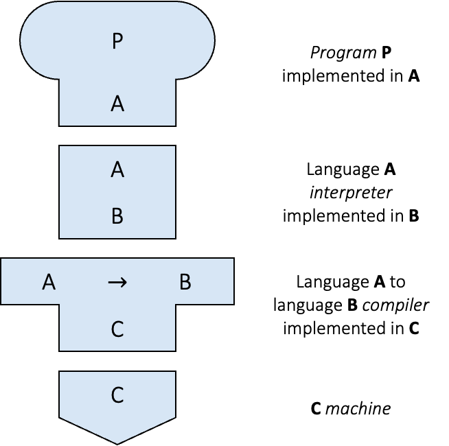
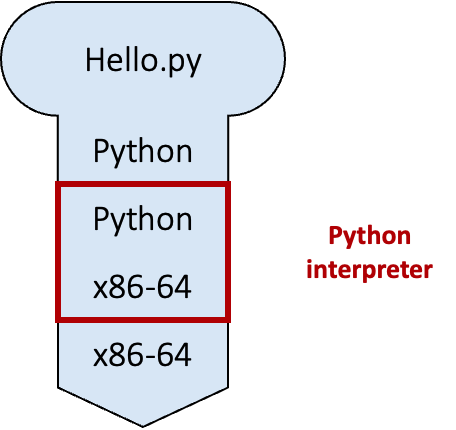
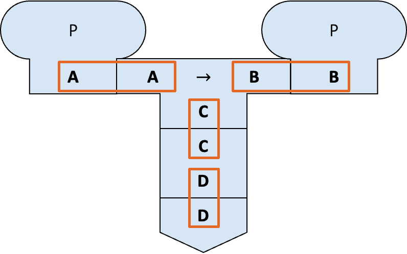
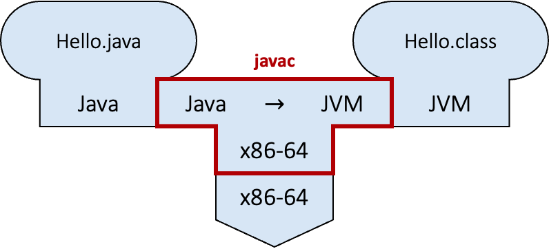
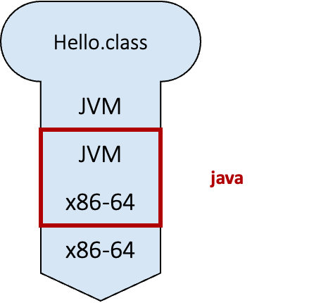
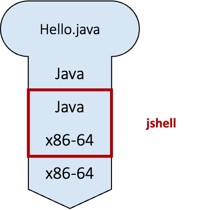

# Unit 1: Program and Compiler


!!! abstract "Learning Objectives"

    After this unit, students should be able to:

    - explain what a program is and why programs written in high-level languages must be translated before execution;
    - distinguish between compilation and interpretation as execution strategies, and describe how modern systems (including Java) combine both;
    - explain how Java programs are compiled and executed using javac, java, bytecode, and the Java Virtual Machine (JVM);
    - interpret tombstone (T-) diagrams to reason about how programs, compilers, interpreters, and machines interact;
    - distinguish between compile-time and runtime errors, and explain the role and limitations of the compiler in detecting errors.

!!! info "Overview"

    In this course, we will spend a lot of time learning how to design programs so that errors are caught as early as possible, ideally before the program ever runs. Many of the programming constructs you will encounter in CS2030/S, such as strong static typing, generics, immutability, and functional-style programming, exist precisely to help the compiler detect mistakes early and reliably.

    To understand why these ideas matter, it is important to first understand how programs are executed. A computer's hardware can only understand instructions written in machine code, yet programmers write programs in high-level languages such as Java. Bridging this gap requires translation, and this translation process—whether done by a compiler, an interpreter, or a combination of both—fundamentally shapes how programs behave, how errors arise, and what kinds of mistakes can be detected automatically.

    This unit introduces the basic concepts of programs, programming languages, compilers, and interpreters, using Java as the primary example. We will examine how Java programs are compiled and executed, how different execution models can be represented using diagrams, and why the distinction between compile-time and runtime errors is so important in practice.

    By the end of this unit, you should have a clear mental model of how your Java programs move from source code to execution, and why the compiler plays such a central role in helping programmers write correct and reliable software. This mental model will serve as a foundation for everything else you learn in CS2030/S.


## Software Program

A software program is a collection of data variables and instructions on how to modify these variables.  To dictate these instructions to the computer, programmers usually write down the instructions using a programming language, expressing their instructions in code that is made up of keywords, symbols, and names.

A programming language is a formal language that helps programmers specify _precisely_ what the instructions are at a higher level of _abstraction_ (i.e., at a higher conceptual level) so that a programmer only needs to write a few lines of code to give complex instructions to the computer.


## Compiled vs. Interpreted Programs

The processing unit of a computer can only accept and understand instructions written in machine code.  A program, written in a higher-level programming language, therefore needs to be translated into machine code before execution.  There are different approaches to how such translations can be done.  The first approach uses a _compiler_ &mdash; a software tool that reads the entire program written in a higher-level programming language and translates it into machine code.  The machine code is then saved into an executable file, which can be executed later.  `clang`, a C/C++ compiler, is an example.  The second approach uses an _interpreter_ &mdash; software that reads in the program one statement at a time, interprets what the statement means, and executes it directly.  This is how Python and JavaScript programs are usually executed.  

Note that whether a program is compiled or interpreted depends on how the program is executed, and not on the programming language used.  For example, Python is usually interpreted, but there are Python compilers that can compile Python programs into machine code.  Similarly, C/C++ is usually compiled, but there are C/C++ interpreters as well.

Furthermore, modern programming systems for executing programs are more sophisticated.  V8, for instance, is an open-source engine that executes JavaScript, and it contains both an interpreter that first interprets a JavaScript program into _bytecode_ (an intermediate, low-level representation) and its execution engine. A just-in-time compiler then reads in the bytecode and generates machine code dynamically at runtime with optimized performance. 

Java programs, on the other hand, can be executed in two ways:

1. The Java program can first be compiled into bytecode.  During execution, the bytecode is interpreted and compiled on the fly by the _Java Virtual Machine_ (JVM) into machine code.
2. The Java program can be interpreted by the Java interpreter.

To better understand this distinction, we will introduce a visual aid to describe the relationships between programs, compilers, interpreters, and machines.

### Tombstone Diagrams (T-Diagrams)

Tombstone Diagrams or T-diagrams consist of combinations of the following four components: 

- <u>*Programs*</u> which are implemented in a particular language (i.e., `Java`, `Python`, `C/C++`)
- Language **A** <u>*Interpreters*</u> implemented in language **B**
- Language **A** to language **B** <u>*Compilers*</u> which are implemented in a language **C**
- Physical <u>*Machines*</u> implementing a particular language (i.e., x86-64, ARM-64)

These components are represented in T-diagrams as shown in the figure below:

<!--
compiler-0.png:   PNG image data, 2538 x 2858, 8-bit colormap, non-interlaced
compiler-1.png:   PNG image data, 1529 x 1688, 8-bit colormap, non-interlaced
compiler-2.png:   PNG image data, 2875 x 1338, 8-bit colormap, non-interlaced
compiler-3.png:   PNG image data, 1208 x 1679, 8-bit colormap, non-interlaced
compiler-4.png:   PNG image data, 1221 x 1679, 8-bit colormap, non-interlaced
compiler-5.png:   PNG image data, 2863 x 1917, 8-bit colormap, non-interlaced
Divide by 7 to get the width below
-->

<figure markdown="span">
<br>
{ width=362 }
  <figcaption></figcaption>
</figure>

We can treat these components like "puzzle pieces" and build diagrams to describe various execution, compilation, or interpreted processes.  For example, in the diagram below, a Python script `Hello.py` is being interpreted by the Python interpreter running on the x86-64 architecture.

<figure markdown="span">
<br>
{ width=218 }
  <figcaption></figcaption>
<br>
</figure>


*Note:* In order for the diagram to be valid, adjacent connected diagram components need to match. This can be seen in the diagram below (highlighted with blue boxes).

<figure markdown="span">
<br>
{ width=409 }
  <figcaption></figcaption>
<br>
</figure>

T-diagrams give us a precise way to reason about where translation happens and what language each component understands, which helps avoid confusion when working with multiple tools and platforms.

## Compiler

The compiler does more than just translate source code into machine code or bytecode.  The compiler also needs to parse the source code written and check if it follows the precise specification (i.e., the _grammar_) of the programming language used, and produces a _syntax error_ if the grammar is violated.  It therefore can detect any syntax error before the program is run.

The compiler, however, can also perform more sophisticated checks on the source code to detect other types of errors.  Much of the information a compiler uses to detect errors comes from types, which describe what kind of values variables and expressions can take.  We will vist types in the next unit.  These errors are called _semantic errors_.  A type error, for example, occurs when a programmer tries to perform an operation on a variable that is not allowed according to the variable's type.  For example, trying to multiply a number and a string would result in a type error in Java.

It is much better for a programmer to detect any error in its code during compilation &mdash; since this is the phase when the program is still being developed and under the control of the programmer.  Such errors is called _compile-time errors_.  A _runtime error_, on the other hand, might occur when the users are running the program, and so are much less desirable.  As such, we __try to detect errors as much as possible during compilation__.  The compiler is a powerful friend for any programmer if used properly.  This guiding principle underlies much of the concepts that we will encounter in this course.

For instance, in Java, the statement

```Java
x <- 0
```

would lead to a compile-time error, since the assignment operator in Java is `=` and not `<-`.  The compiler can easily detect this syntax error without running the program.

The power of the compiler, however, is limited.  A compiler can only read and analyze the source code without actually running it.  Without running the program, the compiler cannot always tell if a particular statement in the source code will ever be executed; it cannot always tell what values a variable will take.

The following statement in Java, however, follows the correct syntax and would not cause a compile-time error:

```Java
int x = a / b;
```

However, if the value of `b` is zero at runtime, this statement would lead to a runtime error (division by zero).  The compiler cannot always determine whether `b` can be zero or not without actually running the program.

To deal with this, the compiler can either be _conservative_, and report an error as long as _there is a possibility_ that a particular statement is incorrect; or the compiler can be more _permissive_, reporting an error only if _there is no possibility_ that a particular statement is correct.  If there is a possibility that a particular statement is correct, it does not throw an error but relies on the programmer to do the right thing.    Sometimes, the compiler may generate a _compilation warning_, indicating that there is a potential problem, but it does not prevent the program from being compiled.

As you will see in CS2030/S, many Java design choices favor conservative compilation to catch errors early, even if it occasionally rejects code that "might work."  We will further contrast these two behaviors later in this course.

We will now look at the two approaches to execute a Java program in more detail (without worrying about how to write a single line of Java first).

### Compiling and Running Java Programs

Suppose we have a Java program called `Hello.java`.  Before we run the program, we first need to compile it.  To compile the program, we type[^1]

```
$ javac Hello.java
```

into the command line.  `javac` is the Java compiler.  This step will either lead to the bytecode called `Hello.class` being created or generate some errors.  This process can be seen in the figure below, where the `Hello.java` program is compiled from Java to the JVM bytecode. The Java compiler `javac` in this diagram is implemented in the x86-64 machine code.

<figure markdown="span">
<br>
{ width=410 }
  <figcaption></figcaption>
<br>
</figure>

We can run the Java program only after it has been successfully compiled without any errors. 
Assuming that there is no error in compilation, we can now run

```
$ java Hello
```

to invoke the JVM `java` and execute the bytecode contained in the file `Hello.class`. This can be seen in the figure below, where the `Hello.class` program is interpreted from JVM language (_bytecode_) to the x86-64 machine code.

!!! warning "Passing in filename instead of class name"

    A common mistake is to invoke `java` with the filename (including the `.class` extension) instead:
    ```
    $ java Hello.class
    ```

    This will result in the following error:
    ```
    Error: Could not find or load main class Hello.class
    Caused by: java.lang.ClassNotFoundException: Hello.class
    ```
    

<figure markdown="span">
<br>
{ width=172 }
  <figcaption></figcaption>
<br>
</figure>


[^1]: The `$` represents the command prompt in a shell and you do not need to type this.

Beginners tend to confuse between `javac` and `java`, and whether to add the extension `.java` or `.class` when compiling and executing a Java program.  Remember: 

- `javac` compiles; `java` runs.
- `javac` always takes `.java`; `java` never takes `.class`.

!!! note "java Hello.java"
    
    To add to the confusion, Java 11 introduces a shortcut where we can run:
    ```
    $ java Hello.java
    ```

    directly in certain cases.  This command causes `Hello.java` to be compiled and executed in a single step. This feature is described in more details in the document ["Launching Single-File Source-Code Programs"](https://dev.java/learn/single-file-program/) from Oracle.
    
    We won't do this in CS2030/S (i) to avoid confusion and (ii) to show you the steps explicitly.


### Interpreting a Java program

Java (version 8 or later) comes with an interpreter called `jshell` that can read Java statements, evaluate them, and print the results[^3]. `jshell` is useful for learning and experimenting with Java.   This can be seen in the figure below, where the `Hello.java` program is interpreted from Java directly to the x86-64 machine code. 

<figure markdown="span">
<br>
{ width=174 }
  <figcaption></figcaption>
<br>
</figure>

To run `jshell` in interactive mode, we type

```
$ jshell
```

on the command line, which causes an interactive prompt to appear:

```
$ jshell
|  Welcome to JShell -- Version 25.0.3
|  For an introduction type: /help intro

jshell>
```

We can now type in Java code on `jshell>`. 

Alternatively, we can also include all the Java statements that we want `jshell` to run in a file and pass it into jshell as follows.

```
$ jshell Hello.jsh
```

[^3]: Such a program is called REPL (Read-Evaluate-Print in a Loop) for short.

While `jshell` is a convenient way to test things out and play with new Java concepts as we learn, do keep in mind that `jshell` combines both compilation and runtime into a single step.  The error spewed out by `jshell` could be either a compile-time error or a runtime error, and this could be confusing to beginners who try to distinguish between the two phases of program execution.  A compile-time error typically starts with the line
```
|  Error:
```     
while runtime error starts with the line
```
| Exception ..
```


!!! note "jsh vs java"
    Files intended to be run on `jshell` typically uses `.jsh` extension while files intended to be compiled and run use `.java` extension.  However, this difference is merely a convention.  You can still interpret `.java` program on `jshell`.


