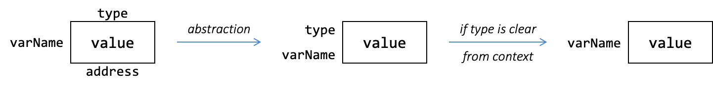

# Unit 2: Variable and Type
!!! abstract "Learning Objectives"

    After this unit, students should be able to:

    - explain how variables and types act as abstractions over memory and data, and why they are necessary for writing meaningful programs;
    - distinguish between static vs. dynamic typing and strong vs. weak typing, and reason about their consequences for error detection and program safety;
    - identify and apply Java's primitive types, including their sizes, literal forms, and value semantics;
    - reason about subtyping among Java primitive types and determine whether an assignment or parameter passing is allowed;
    - apply the widening conversion rule ($S$ $<:$ $T$) to predict and explain compile-time type errors in Java programs.

!!! info "Overview" 
    As programs grow in size and complexity, programmers must manage an increasing number of data values and the operations performed on them. Writing correct programs is not just about syntax—it is about ensuring that operations on data are meaningful and safe.

    This unit is organized around a central question:

    > How does a programming language help prevent meaningless programs involving data?

    We begin with variables, which provide an abstraction over memory locations, allowing programmers to name and manipulate data without worrying about where it is stored. 

    A key goal of a programming language is _safety_ (i.e., preventing programs from performing meaningless or invalid operations on variables during execution).  This goal can be achieved through tagging each variable with a _type_ that describes the kind of data it holds and the operations that can be performed on it.  A type-safe language ensures that operations are only applied to values for which they are meaningful.

    Programming languages differ in how and when they enforce these restrictions. In this unit, we contrast static vs. dynamic typing and strong vs. weak typing, focusing on how Java's static and strong typing enables the compiler to detect certain errors before a program is run.

    We then examine Java's primitive types and the concept of subtyping, which allows limited flexibility while preserving safety. Subtyping explains why some assignments are allowed and others are rejected, leading to the rule of widening type conversion used by the Java compiler.

## Data Abstraction: Variable

One of the important abstractions that are provided by a programming language is the _variable_.  Data are stored in some location in computer memory.  However, we should not be referring to the memory location all the time.  First, referring to something like a memory address such as `0xFA49130E` is not user-friendly; Second, the location may change.  A _variable_ is an abstraction that allows us to give a user-friendly name to a piece of data in memory.  We use the _variable name_ whenever we want to access the _value_ in that location, and a _pointer to the variable_ or _reference to the variable_ whenever we wish to refer to the address of the location.

<figure markdown="span">
<br>

  <figcaption></figcaption>
<br>
</figure>

## Type

As programs get more complex, the number of variables that the programmer needs to keep track of increases.  These variables might be an abstraction over different types of data: some variables might refer to a number, some to a string, some to a list of numbers, etc.  Not all operations are meaningful over all types of data.

To help mitigate the complexity,  we can assign a _type_ to a variable.  The type communicates to the readers what data type the variable is an abstraction over, and to the compiler/interpreter what operations are valid on this variable and how the operation behaves.  In lower-level programming languages like C, the type also informs the compiler how the bit representing the variable should be interpreted.

As an example of how types can affect how an operation behaves, let's consider
Python.  Suppose we have two variables `x` and `y`, storing the values `4` and `5` respectively and we run `print(x + y)`.

- If `x` and `y` are both strings, the output is `45`.
- If `x` and `y` are both integers, the output is `9`.
- If `x` is an integer and `y` is a string (or vice versa), you would get an error.

In the last instance above, you see that assigning a type to each variable helps to keep the program meaningful, as the operation `+` is not defined over an integer and a string in Python.

Java and JavaScript, however,  will implicitly convert `4` into a string and return `45`.

### Dynamic vs. Static Type

Python and JavaScript are examples of _dynamically typed_ programming languages.  The same variable can hold values of different _unrelated_ types, and checking if the right type is used is done during _runtime_ (i.e., during the execution of the program).  Note that, the type is associated with the _values_, and the type of the variable changes depending on the value it holds.  For example, we can do the following:

=== "JavaScript"

    ```Javascript title="Demonstration of Dynamic Typing"
    let i = 4;   // i is an integer
    i = "5";     // ok, i is now a string
    ```

=== "Python"

    ```Python title="Demonstration of Dynamic Typing"
    i = 4         # i is an integer
    i = "5"       # ok, i is now a string
    ```

Java, on the other hand, is a _statically typed_ language.  We need to _declare_ every variable we use in the program and specify its type.  A variable can only hold values of the same type as the type of the variable (or its subtype, as you will see later) so we can't assign, for instance, a string to a variable of type `int`.  Once a variable is _declared_ with a particular type, the type of the variable cannot be changed.  In other words, the variable can only hold values of that declared type.

```Java title="Demonstration of Static Typing"
int i;   // declare a variable of type int
i = 4;   // ok because 4 is of type int
i = "5"; // error, cannot assign a string to an `int`
```

The type that a variable is assigned when we declare the variable is also known as the _compile-time type_, or CTT for short.  We sometimes use the notation $CTT(v)$ to denote the compile-time type of a variable $v$ (or an expression $e$).
The value stored in the variable has a _runtime type_.  We use the abbreviation RTT to denote runtime type, and use the notation $RTT(v)$ to denote the runtime type of a variable $v$ (or an expression $e$).

During the compilation, the compile-time type is the only type that the compiler is aware of.  The compiler will reason and check if the compile-time types match when it parses the variables, expressions, values, and function calls, and throw an error if there is a type mismatch.  This type-checking step helps to catch errors in the code early.

Note that the compiler does **not** execute the programs it compiles, and thus it cannot reason using the runtime types of the variables. This is still the case even if the runtime types seems _trivial_ (e.g., instantiated in the immediately preceding statement).

### Strong Typing vs. Weak Typing

A _type system_ of a programming language is a set of rules that governs how the types can interact with each other.

A programming language can be strongly typed or weakly typed.  There are no formal definitions of "strong" vs. "weak" typing of a programming language, and there is a spectrum of "strength" between the typing discipline of a language.

Generally, a _strongly typed_ programming language enforces strict rules in its type system, to ensure _type safety_ (i.e., to guarantee that operations are only applied to values of appropriate types) preventing certain classes of runtime errors.  For instance, catching an attempt at multiplying two strings.  One way to ensure type safety is to catch type errors during compile time rather than leaving it to runtime.

On the other hand, a _weakly typed_ (or loosely typed) programming language is more permissive in terms of typing checking.  C is an example of a static, weakly typed language[^1].  In C, the following is possible:

[^1]: Strong and weak are relative.  Some authors may say that C is a strongly typed language.  This is true in relation to more weakly typed language such as assembly.

```C title="Demonstration of Weak Typing in C"
int i;        // declare a variable of type int
i = 4;        // ok because 4 is of type int
i = (int)"5"; // you want to treat a string as an int? ok, as you wish!   
```

The last line forces the C compiler to treat the string (to be more precise, the _address_ of the string) as an integer, through type casting.

In contrast, if we try the following in Java:

```Java title="Demonstration of Strong Typing in Java"
int i;        // declare a variable of type int
i = 4;        // ok because 4 is of type int
i = (int)"5"; // error
```

we will get the following compile-time error message:

```
|  incompatible types: java.lang.String cannot be converted to int
```

because the compiler enforces a stricter rule and allows type casting only if it makes sense.  More specifically, we will get a compilation error if the compiler can determine with _certainty_ that such conversion can never happen successfully.

## Type Checking with A Compiler

In addition to checking for syntax errors, the compiler can check for type compatibility according to the compile-time type, to catch possible errors as early as possible.  Such type-checking is made possible with static typing.  Consider the following Python program:

```Python title="Dynamic Typing Leads to Runtime Error"
i = 0
while (i < 10):
    : # do something that takes a long time
  i = i + 1
print("i is " + i)  # error after a long execution
```

Since Python does not allow adding a string to an integer, there is a type mismatch error on Line 5.  The type mismatch error is only caught when Line 5 is executed after the program executes for a long time.  Since the type of the variable `i` can change during runtime, Python (and generally, dynamically typed languages) cannot tell if Line 5 will lead to an error until it is evaluated during runtime.

In contrast, statically typed language like Java can detect type mismatch during compile time since the compile-time type of a variable is fixed.  As you will see later, Java allows "addition" or string and integer, but not multiplication of a string and an integer.  If we have the following code, Java can confidently produce compilation errors without even running a program: 

```Java title="Static Typing Catches Type Mismatch Early"
int i = 0
while (i < 10) {
    : // do something that takes a long time
  i = i + 1;
}
String s = "i is " * i; // error during compilation
```

Unfortunately, the check is only done using the compile-time type information.  This leads to _false positives_ where correct programs are rejected.  Java will reject the following code although it will never produce an error.

```Java title="Static Typing Leads to False Positive"
int i = 0
i = i + 1;
String s = "i is ";
if (i == 0) {      // it will never be zero,
  s = "i is " * i; //   but still produces error during compilation
} else {
  s = "i is " + i; // not an error in Java
}
```


## Primitive Types in Java

We now switch our focus to Java, particularly to the types supported.  There are two categories of types in Java, the _primitive types_ and the _reference types_.  We will first look at primitive types in this unit.

For initialization behavior, keep this distinction in mind:

- Local variables (primitive or reference) must be explicitly initialized before use.
- Fields are auto-initialized to default values; for reference fields, the default is `null`.

Primitive types are types that hold numeric values (integers, floating-point numbers) as well as boolean values (`true` _and_ `false`).

For storing integral values, Java provides four types, `byte`, `short`, `int`, and `long`, for storing 8-bit, 16-bit, 32-bit, and 64-bit signed integers respectively.  The type `char` stores 16-bit unsigned integers representing UTF-16 Unicode characters.

For storing floating-point values, Java provides two types, `float` and `double`, for 32-bit and 64-bit floating-point numbers.

Unlike reference types, which we will see later, primitive type variables never share their value with each other.  For instance, if we have:

```Java
int i = 1000;
int j = i;
i = i + 1;
```

`i` and `j` each store a copy of the value `1000` after Line 2.  Changing `i` on Line 3 does not change the content of `j`.

| Kinds | Types | Sizes (in bits) | Default Value |
|-------|-------|-----------------|---------------|
| Boolean | `boolean` | JVM dependent[^2] | `false` |
| Character | `char` | 16 | `'\u0000'` (empty character) |
| Integral | `byte`<br>`short`<br>`int`<br>`long` | 8<br>16<br>32<br>64 | `0`<br>`0`<br>`0`<br>`0L` |
| Floating-Point | `float`<br>`double` | 32<br>64 | `0.0f`<br>`0.0` |

[^2]: While a boolean conceptually represents a single bit of information, its storage size typically varies in practice due to hardware efficiency considerations.  Java specification leaves it unspecified and up to the JVM implementation.

!!! info "Long and Float Constant"
     By default, an integer literal (e.g., `67`) is assigned an `int` type. To differentiate between a `long` and an `int` constant, you can use the suffix `L` to denote that the value is expected to be of `long` type (e.g., `67L` is a `long`).  This is important for large values beyond the range of `int`.  On the other hand, if the constant is a floating-point constant (e.g., `20.30`), by default it is treated as type `double`.  You need to add the suffix `f` to indicate that the value is to be treated as a `float` type (e.g., `20.30f` is a `float`).

## Subtypes

An important concept that we will visit repeatedly in CS2030/S is the concept of subtypes.

Let $S$ and $T$ be two types.  We say that $T$ is a _subtype_ of $S$ if _a piece of code written for variables of type $S$ can also safely be used on variables of type $T$_.

We use the notation $T$ $<:$ $S$ or $S$ $:>$ $T$ to denote that $T$ is a subtype of $S$.  The subtyping relationship in general must satisfy two properties:

1. **Reflexive**: For any type $S$, we have $S$ $<:$ $S$ (i.e., $S$ is a subtype of itself).
2. **Transitive**: If $S$ $<:$ $T$ and $T$ $<:$ $U$, then $S$ $<:$ $U$.  In other words, if $S$ is a subtype of $T$ and $T$ is a subtype of $U$, then $S$ is a subtype of $U$.

Additionally, in Java, you will find that the subtyping relationship also satisfies _anti-symmetry_.  However, this is often omitted as it is enforced by design.

- **Anti-Symmetry**: If $S$ $<:$ $T$ and $T$ $<:$ $S$, then $S$ must be the same type as $T$ (i.e., $S$ $=$ $T$).

Related to the subtype relationship, 

- We use the term _supertype_ to denote the reversed relationship: if $T$ is a subtype of $S$, then $S$ is a supertype of $T$.
- In specific scenarios, we use the term _proper subtype_ (or $<$) to denote a stricter subtyping: if $T$ $<:$ $S$ and $T$ $\not =$ $S$, then $T$ is a proper subtype of $S$, denoted as $T$ $<$ $S$.

### Subtyping Between Java Primitive Types

Considering the range of values that the primitive types can take, Java defines the following subtyping relationship:

- `byte` $<:$ `short` $<:$ `int` $<:$ `long` $<:$ `float` $<:$ `double`
- `char` $<:$ `int`

Graphically, we can draw the subtyping relationship as an arrow from subtype to supertype.  In the case of Java primitive types, we can visualize the subtyping relationship as follows:

<p>
--8<-- "docs/figures/primitive-subtype.svg"
</p>

!!! info "Long $<:$ Float?"
    Why is `long` a subtype of `float`?  More specifically, `long` is 64-bit, and `float` is only 32-bit.  There are more values in `long` than in `float`.

    The resolution lies in the _range_ of values that can be represented with `float` and `long`. `long` can represent every integer between -2<sup>63</sup> and 2<sup>63</sup>-1, a 19-digit number.  `float`, however, can represent floating point numbers as big as 38 digits in the integral part (although it can not represent _every_ floating point number and every integer values within the range).

    Thus, a piece of code written to handle `float` can also handle `long` (since all `long` values can be represented with a `float`, albeit with possible loss of precision).

    ```Java title="Code that Handles `float` can also Handle `long`"
    float add(float x) {
      return x + x;
    }

    long x = 9223372036854775807L; 
    float y = add(x); // ok
    ```

    On the other hand, if a piece of code is written to handle `long`, then giving it a `float` value would be erroneous since the `float` value might have more than 19 digits in the integral part and cannot be represented by `long`.

    ```Java title="Code that Handles `long` cannot Handle `float`"
    long add(long x) {
      return x + x;
    }

    float x = 3.4e+38f;
    long y = add(x); // error: incompatible types: possible lossy conversion from float to long
    ```

    Subtyping is about whether a piece of code written for one type can also be used for another type safely.  It is not about the size (in bits) of the types.
    
Valid subtype relationship is part of what the Java compiler checks for when it compiles.  Consider the following example:

 ```Java title="Subtyping in Assignment"
 double d = 5.0;
 int i = 5;
 d = i; // ok
 i = d; // error
 ```

Line 4 above would lead to an error:

```
|  incompatible types: possible lossy conversion from double to int
```

but Line 3 is OK.

To understand why, let's consider the compile-time type of `d` and `i`. The compile-time type of the variable `d` is `double` because that is what we declared it as.  Similarly, the compile-time type of the variable `i` is `int`.  `double` can hold a larger range of values than `int`, thus all values that can be represented by `i` can be represented by `d` (with possible loss of precision).  Using the terminology that you just learned, `double` is a supertype of `int`.  

On Line 3, the Java compiler allows the value stored inside `i` to be copied to `d`.  The worst that could happen is that we lose a bit of precision.  On Line 4, however, we try to copy the value stored in `d` to `i`.  Since `d` is a `double`, it can store a value outside the range supported by `i` and can have order of magnitudes difference between them.  This would be a problem if the code is allowed to execute!

This example shows how subtyping applies to type checking.  _Java allows a variable of type $T$ to hold a value from a variable of type $S$ only if $S$ $<:$ $T$_.  This step is called _widening type conversion_.  Such widening type conversion can happen during assignment or parameter passing.

The term "widening" is easy to see for primitive types --  the subtype has a narrower range of values than the supertype. The opposite conversion is called _narrowing_ because the range of values is narrower.

Some of the readers might notice that, in the example above, the value of `d` is 5.0, so, we can store the value as `5` in `i`, without any loss.  Or, in Line 3, we already copied the value stored in `i` to `d`, and we are just copying it back to `i`?   Since the value in `d` now can be represented by `i`, what is wrong with copying it back?  Why doesn't the compiler allow Line 4 to proceed?

The reason is that the compiler does not execute the code (which is when assigning 5.0 to `d` happens) and it (largely) looks at the code, statement-by-statement. Thus, the line `i = d` is considered independently from the earlier code shown in the example.  In practice, Line 4 might appear thousands of lines away from earlier lines, or may even be placed in a different source file.  The values stored in `d` might not be known until runtime (e.g., it might be an input from the user).

## Additional Readings

- [Java Tutorial: Primitive Data Types](https://docs.oracle.com/javase/tutorial/java/nutsandbolts/datatypes.html) and other [Language Basics](https://docs.oracle.com/javase/tutorial/java/nutsandbolts/index.html)
