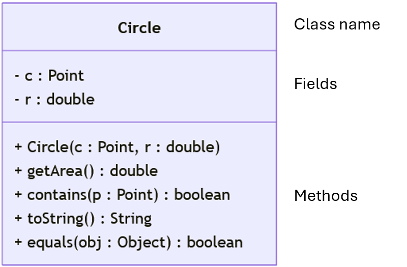
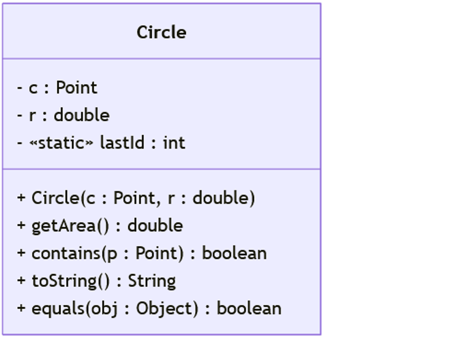
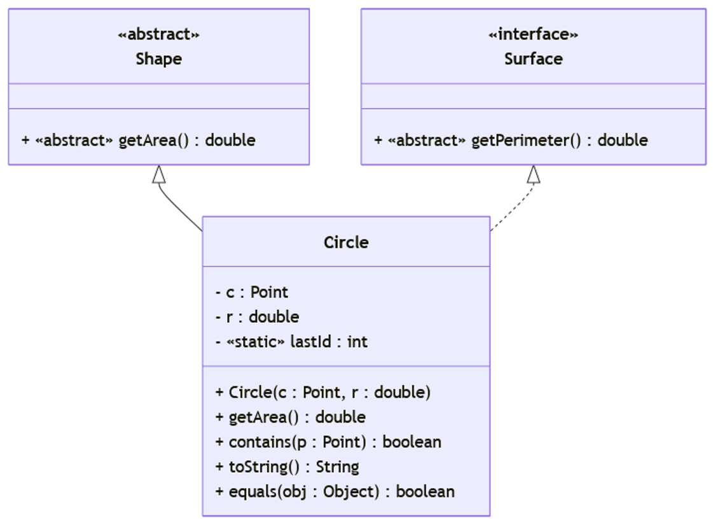

# Unit 19: Class Diagram

!!! abstract "Learning Objectives"

    After this unit, students should be able to:

    - use class diagram to design classess/interfaces and the relationships between them;
    - translate class diagrams into code;
    - design and reason about solutions using class diagram.

!!! info "Overview"

    In the previous units, we used inheritance, overriding, and overloading to design our class hierarchy.  Our fields/methods may also be annotated with different modifiers.  We also introduced different kinds of abstract types such as abstract class and interface.

    In this unit, we introduce class diagram to visualize and understand relationships between classes/interfaces at a glace.  This helps spot issues before they occur.  Additionally, this allows us to communicate our design more effectively to other people.

## Class Diagram

Class diagram is a way to model our classes/interfaces without coding them. It is part of the Unified Modeling Language (UML), but will not use the full feature of UML.  Our brief introduction to class diagram covers only parts that are useful for our course.


## Class

A class diagram records only the summary of a class.  The simplest element of a class diagram is a class.  It is drawn as a rectangle divided into three sections.

1. Class Name.
2. Fields.
3. Methods.

In between each segment we draw a line to clearly delimit each segment. For best result, the order in which the fields and methods appear should be identical to how they appear in the code.

In essence, this is a summary of class.  We can summarize class fields with their names and types.  This is applicable for both instance field and class fields.  Unlike method descriptor, our summary of a method adds the parameter names back to avoid potential confusion with the role played by the parameter.

Access modifiers are represented as follows.

| Modifiers | Symbol |
|---|---|
| `private` | - |
| `public` | + |

Consider the simple Circle v0.7a reproduced below.  Note that constructor has no return type, so it will be omitted in the class diagram.

```Java title="Circle v0.7a with Overriding equals" hl_lines="4-6 11 19 26 35 43"
/**
 * A Circle object encapsulates a circle on a 2D plane.
 */
class Circle {
  private Point c;   // the center
  private double r;  // the length of the radius

  /**
   * Create a circle centered on Point c with given radius r
   */
  public Circle(Point c, double r) {
    this.c = c;
    this.r = r;
  }

  /**
   * Return the area of the circle.
   */
  public double getArea() {
    return Math.PI * this.r * this.r;
  }

  /**
   * Return true if the given point p is within the circle.
   */
  public boolean contains(Point p) {
    return false;
    // TODO: Left as an exercise
  }

  /**
   * Return the string representation of this circle.
   */
  @Override
  public String toString() {
    return "{ center: " + this.c + ", radius: " + this.r + " }";
  }

  /**
   * Return true the object is the same circle (i.e., same center, same radius).
   */
  @Override
  public boolean equals(Object obj) {
    if (obj instanceof Circle) {
      Circle circle = (Circle) obj;
      return (circle.c.equals(this.c) && circle.r == this.r);
    }
    return false;
  }
}
```

The class diagram is as follows.

{ width="500px" }

Consider the `contains(Point)` method.

```java
public boolean contains(Point p) {
  return false;
  // TODO: Left as an exercise
}
```

The required summary for class diagram is simply `public boolean contains(Point p)`.  Converting this to the notation for class diagram, we get `+ contains(p : Point) : boolean`.

### Be Explicit

Unlike the proper UML class diagram, we will simply ask you to be explicit when drawing your class diagram.  If you require a field to be static, then add `«static»` to the field.  If you require a method to be abstract, then simply add `«abstract»`.  The symbol `« .. »` can be used for any modifiers needed in this course.

{ width="500px" }


## Relationships

We can represent inheritance using arrows.  This is the same idea as we have seen for primitive subtyping.  There are two kinds of arrows for two different kinds of inheritance.  If we inherit from a class, then we use solid arrows.  If we inherit from an interface, then we use dashed arrows.

Consider the following classes/interfaces and their relationships.

```java title="Surface, Shape, and Circle"
abstract class Shape {
  public abstract double getArea();
}

interface Surface {
  double getPerimeter();
}

class Circle extends Shape implements Surface {
    :
}
```

We can represent them in a class diagram as follows.

{ width="700px" }

The class diagram above allows us to also find issues with our current design.  In particular, notice that the class `Circle` has no non-abstract method that overrides `public double getPerimeter()`.  Additionally, the class `Circle` itself is not declared abstract.  As such, this design will produce compilation error before we implement the class.