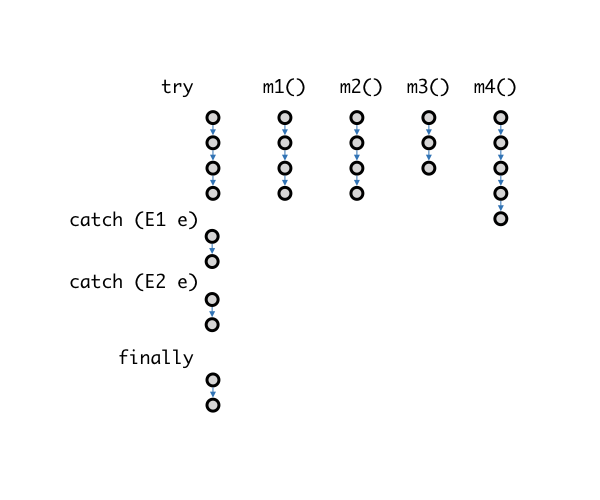
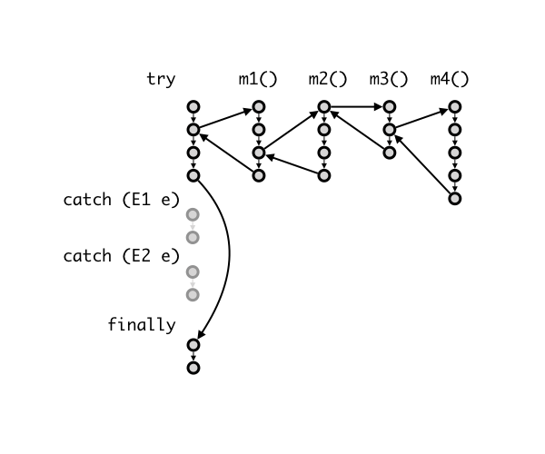
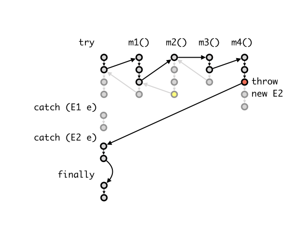

# Unit 23: Exceptions

!!! abstract "Learning Objectives"

    After this unit, students should be able to:

    - explain why exceptions improve program structure compared to error codes and global state;
    - trace and reason about exception control flow across method calls (`try`, `catch`, and `finally`);
    - distinguish checked vs unchecked exceptions and justify when each should be used;
    - design methods that throw, handle, or propagate exceptions appropriately;
    - apply good exception-handling practices without breaking abstraction barriers.

!!! info "Overview"

    In earlier units, you have already encountered runtime exceptions such as `NullPointerException`, `ClassCastException`, and `ArrayStoreException`. These exceptions are thrown automatically by Java when fundamental safety rules are violated, for example, invoking a method on null, performing an invalid cast, or storing an incompatible object into an array.

    So far, when such an exception occurs, the program typically terminates with a stack trace. As programmers, however, we often want more control: to detect invalid situations earlier, provide clearer error messages, recover gracefully, or enforce constraints specific to our own abstractions.

    This unit introduces exceptions as a programming construct. You will learn how to use `try`, `catch`, and `finally` to separate normal program logic from error handling, and how to define and throw your own exceptions to enforce the rules of your classes, just as Java does for its built-in abstractions.

    By the end of this unit, you should learn to use exceptions as a deliberate design tool for writing robust, well-structured programs.

## A Motivating Example from a C program

One of the nuances of programming is having to write code to deal with exceptions and errors. Consider writing a method that reads a single integer value from a file.  Here are some things that could go wrong:

- The file to read from may not exist
- The file to read from exists, but you may not have permission to read it
- You can open the file for reading, but it might contain non-numeric text where you expect numerical values
- The file might contain fewer values than expected
- The file might become unreadable as you are reading through it (e.g., someone unplugs the USB drive)

In C, we usually have to write code like this:

```C title="Handling Errors when Opening and Reading a File in C" hl_lines="1 13"
fd = fopen(filename,"r");
if (fd == NULL) {
  fprintf(stderr, "Unable to open file. ");
  if (errno == ENFILE) {
    fprintf(stderr, "Too many opened files.  Unable to open another\n");
  } else if (errno == ENOENT) {
    fprintf(stderr, "No such file %s\n", filename);
  } else if (errno == EACCES) {
    fprintf(stderr, "No read permission to %s\n", filename);
  }
  return -1;
}
scanned = fscanf(fd, "%d", &value);
if (scanned == 0) {
  fprintf(stderr, "Unable to scan for an integer\n");
  fclose(fd);
  return -2;
}
if (scanned == EOF) {
  fprintf(stderr, "No input found.\n");
  fclose(fd);
  return -3;
}
```

Out of the lines above, only TWO lines correspond to the actual task of opening and reading in a file, the others are for exception checking/handling.  The actual tasks are interspersed between exception-checking code, which makes reading and understanding the logic of the code difficult.

The examples above also have to return different values to the calling method, because the calling method may have to do something to handle the errors. Note that the POSIX API has a global variable `errno` that signifies the detailed error. First, we have to check for different `errno` values and react accordingly (we can use `perror`, but that has its limits). Second, `errno` is global, and using a global variable is a bad practice.  In fact, the code above might not work because `fprintf` in Line 3 might have changed `errno`.

Finally, another issue is having to repeatedly clean up after an error &mdash; here we `fclose` the file if there is an error reading, twice. It is easy to forget to do so if we have to do this in multiple places.  Furthermore, if we need to perform a more complex cleanup, then we would end up with lots of repeated code.

Many modern programming languages support exceptions as a programming construct.  In Java, this is done with `try`, `catch`, `finally` keywords, and a hierarchy of `Exception` classes.  The `try`/`catch`/`finally` keywords group statements that check/handle errors together making code easier to read. The Java equivalent to the above is:

```Java title="Handling Exceptions when Opening and Reading a File in Java" hl_lines="2-4"
try {
  reader = new FileReader(filename);
  scanner = new Scanner(reader);
  value = scanner.nextInt();
}
catch (FileNotFoundException e) {
  System.err.println("Unable to open " + filename + " " + e);
}
catch (InputMismatchException e) {
  System.err.println("Unable to scan for an integer");
}
catch (NoSuchElementException e) {
  System.err.println("No input found");
}
finally {
  if (scanner != null)
    scanner.close();
}
```

Let's look at the example more carefully.  The general syntax for `try`-`catch`- `finally` is the following:

```Java title="Try Catch Finally"
try {
  // do something
} catch (an exception parameter) {
  // handle exception
} catch (another exception parameter) {
  // can have more catch blocks
} finally {
  // clean up code
  // regardless of whether an an exception occurs
}
```

### `try` Block

In the example above, we have the `try` block:

```Java title="Try Block"
try {
  reader = new FileReader(filename);
  scanner = new Scanner(reader);
  value = scanner.nextInt();
}
  :
```

which opens the file and reads an integer from it.  Thus the main task for the code is put together in one place, making it easier to read and understand (and thus less bug-prone).

### `catch` Block

Next we have a sequence of `catch` blocks.

```Java title="Catch Block"
  :
catch (FileNotFoundException e) {
  System.err.println("Unable to open " + filename + " " + e);
} catch (InputMismatchException e) {
  System.err.println("Unable to scan for an integer");
} catch (NoSuchElementException e) {
  System.err.println("No input found");
}
```

The error handling comes under the `catch` blocks, each handling a different type of exception.  In Java, exceptions are instances that are a subtype of the `Exception` class.  Information about an exception is encapsulated in an exception instance and is "passed" into the `catch` block.  In the example above, `e` is the variable containing an exception instance.

The catch blocks are checked in the order they appear in our program from top to bottom. The first catch block that has an exception type compatible with the type of the thrown exception (i.e., a subtype) is selected to handle the exception. This means the actual type of the exception object must be the same as, or a subclass of, the exception type specified in the catch block. Consider if we have `ExceptionX` $<:$ `ExceptionY` and we have the following `catch` block:

```Java title="Catch Block"
  :
} catch(ExceptionY e) {
  // handle ExceptionY
} catch(ExceptionX e) {
  // handle ExceptionX
}
  :
```

As such, we will never execute the second catch as `ExceptionX` will already be caught by `catch(ExceptionY e) { .. }`.  Indeed, the Java compiler will prevent this issue with a compilation error.

```
_.java:_: error: exception ExceptionX has already been caught
        } catch(ExceptionX e) {
          ^
```
Now with the exception, we no longer rely on a special return value from a function nor a global variable to indicate exceptions.

### `finally` Block

_Finally_, we have the optional `finally` clause for housekeeping tasks.  Here, we close the `scanner` if it is opened.

```Java title="Finally Block"
  :
finally {
  if (scanner != null)
    scanner.close();
}
```

In cases where the code to handle the exceptions is the same, you can avoid repetition by combining multiple exceptions into one catch statement:

```Java title="Finally Block with Multiple Exceptions"
catch (FileNotFoundException | InputMismatchException | NoSuchElementException e) {
  System.err.println(e);
}
```

## Throwing Exceptions

The `try`-`catch`-`finally` blocks above show you how to _handle_ exceptions.  Let's see how we can throw an exception.  Let's revisit our `Circle` class.  A circle cannot have a negative radius.  Let's say that we wish our constructor to throw an `IllegalArgumentException` when a negative radius is passed in.  

We need to do two things.  First, we need to declare that the constructor is throwing an exception, with the `throws` keyword.  Second, we have to create a new `IllegalArgumentException` object and throw it to the caller with the `throw` keywords.

```Java title="Circle v0.9 with Exception" hl_lines="5 7"
class Circle {
  private Point c;
  private double r;

  public Circle(Point c, double r) throws IllegalArgumentException {
    if (r < 0) {
      throw new IllegalArgumentException("radius cannot be negative.");
    }
    this.c = c;
    this.r = r;
  }
}
```

Note that executing the `throw` statement causes the method to immediately return.  In the example above, the initialization of the center `c` and radius `r` does not happen.

The caller then can catch and handle this exception:

```Java title="Catching Exception"
try {
  c = new Circle(point, radius);
} catch (IllegalArgumentException e) {
  System.err.println("Illegal argument:" + e.getMessage());
}
```

!!! warning "`throw` vs `throws`"
    The keyword `throws` is used in the method declaration.  The keyword `throw` is used to cause the exceptions.

## Checked vs Unchecked Exceptions

Java distinguishes between two types of exceptions: checked and unchecked.  

An unchecked exception is an exception caused by a programmer's errors.  They should not happen if perfect code is written.  `IllegalArgumentException`, `NullPointerException`, `ClassCastException` are examples of unchecked exceptions.  Generally, unchecked exceptions are not explicitly caught or thrown.  They indicate that something is wrong with the program and cause runtime errors.

A checked exception is an exception that a programmer has no control over.  Even if the code written is perfect, such an exception might still happen.  The programmer should thus actively anticipate the exception and handle them.  For instance, when we open a file, we should anticipate that in some cases, the file cannot be opened.  `FileNotFoundException` is an example of a checked exception.  A checked exception must be either handled, or else the program will not compile.

In Java, unchecked exceptions are subclasses of the class `RuntimeException`.

## Exceptions as Method Contracts

Exceptions are part of a method's contract with its callers. In addition to specifying parameter types and return values, a method also specifies which exceptional situations may occur, typically through its `throws` clause.

For checked exceptions, this contract is enforced by the compiler: any caller must either handle the exception or explicitly propagate it. As a result, changing the set of checked exceptions that a method throws is a change to its public specification and may require changes to all its callers. This is why overridden methods are only allowed to throw the same or more specific checked exceptions.  Callers relying on the original contract must not be surprised by new exceptional behavior. 

Unchecked exceptions, on the other hand, usually signal violated preconditions and are therefore not part of the method's explicit contract, even though they may still occur at runtime.  As such, we do not need to declare them in the `throws` clause.

In Java, checked exceptions are subclasses of the class `Exception` that are not a subclass of `RuntimeException`.

## Passing the Buck

The caller of the method that generates (i.e., `new` and `throw`) an exception need not catch the exception.  The caller can pass the exception to its caller, and so on if the programmer deems that it is not the right place to handle it.  

An unchecked exception, if not caught, will propagate automatically down the stack until either, it is caught or if it is not caught at all, resulting in an error message displayed to the user.

For instance, the following toy program would result in `IllegalArgumentException` being thrown out of `main` and displayed to the user.

```Java title="Throwing Unchecked IllegalArgumentException"
class Main {
  static void createCircles() {
	int radius = 10;
	for (int i = 0; i <= 11; i++) {
		new Circle(new Point(1, 1), radius--);
	}
  }
  public static void main(String[] args) {
	createCircles();
  }
}
```

A checked exception, on the other hand, must be handled.  Consider the following example:

```Java title="Checked Exception v0.1 (Compilation Error)"
class Main {
  static FileReader openFile(String filename) {
    return new FileReader(filename);
  }
  public static void main(String[] args) {
	openFile("input.txt");
  }
}
```

This program won't compile because the checked exception `FileNotFoundException` is not handled.  As the example we have seen, we could handle it in `openFile`.  In this case, `openFile` does not throw any exception.
```Java title="Checked Exception v0.2 (Handled In-Situ)" hl_lines="3 5-7"
class Main {
  static FileReader openFile(String filename) {
	try {
	  return new FileReader(filename);
	} catch (FileNotFoundException e) {
      System.err.println("Unable to open " + filename + " " + e);
	}
	return null;
  }
  public static void main(String[] args) {
	openFile("input.txt");
  }
}
```

Alternatively, `openFile` can pass the buck to the caller instead of catching it.  
```Java title="Checked Exception v0.3 (Passed to Caller)" hl_lines="2 6 8-10"
class Main {
  static FileReader openFile(String filename) throws FileNotFoundException {
	return new FileReader(filename);
  }
  public static void main(String[] args) {
	try {
	  openFile("input.txt");
	} catch (FileNotFoundException e) {
      // warn user and pop up dialog box to select another file.
	}
  }
}
```

Sometimes the caller is a better place to handle the exception.  Where an exception should be handled is a design decision.  We will see some considerations for this later in this unit.

What should not happen is the following:
```Java title="Checked Exception v0.4 (Passed to User)" hl_lines="2 5"
class Toy {
  static FileReader openFile(String filename) throws FileNotFoundException {
	return new FileReader(filename);
  }
  public static void main(String[] args) throws FileNotFoundException {
    openFile("input.txt");
  }
}
```

In the code above, every method passes the buck around.  No one takes the responsibility to handle it and the user ends up with the exception.  The ugly internals of the program (such as the call stack) are then revealed to the user.

_A good program always handles checked exception gracefully_ and hides the details from the users.  

As a guideline, handle an exception at the lowest level that can meaningfully respond to it.  If a method can restore a valid state or clean up resources, it should catch the exception. Otherwise, propagate it upward.

## Control Flow of Exceptions

Here is a more detailed description of the control flow of exceptions. Consider we have a `try`-`catch`-`finally` block that catches two exceptions `E1` and `E2`. Inside the try block, we call a method `m1()`; `m1()` calls `m2()`; `m2()` calls `m3()`, and `m3()` calls `m4()`.



```Java
try {
  m1();
} catch (E1 e) {
    :
} catch (E2 e) {
    :
} finally {
    :
}
```

```Java
void m1() throws E2 {
    :
  m2();
    :
}

void m2() throws E2 {
    :
  m3();
    :
}

void m3() throws E2 {
    :
  m4();
    :
}

void m4() throws E2 {
    :
  throw new E2();
    :
}
```

In a normal (no exception) situation, the control flow looks like this:



The statements in the try block are executed, followed by the statements in the `finally` block.

Now, let's suppose something went wrong deep inside the nested call, in `m4()`. One of the statements executes `throw new E2();`, which causes the execution in `m4()` to stop. JVM now looks for the block of code that catches `E2`, going down the call stack, until it can find a place where the exception is handled. In this example, we suppose that none of `m1()`-`m4()` handles (i.e., `catch`) the exception. Thus, JVM then jumps to the code that handles `E2`. Finally, JVM executes the `finally` block.

Note that the `finally` block is always executed even when `return` or `throw` is called in a catch block.




## Creating Our Own Exceptions

If you find that none of the exceptions provided by Java meet your needs, you can create your own exceptions, by simply inheriting from one of the existing ones. But, you should only do so if there is a good reason, for instance, to provide additional useful information to the exception handler.

Here is an example:

```Java title="User-Defined Exception"
class IllegalCircleException extends IllegalArgumentException {
  Point center;
  IllegalCircleException(String message) {
    super(message);
  }
  IllegalCircleException(Point c, String message) {
    super(message);
    this.center = c;
  }
  @Override
    public String toString() {
      return "The circle centered at " + this.center + " cannot be created:" + getMessage();
    }
}
```

## Overriding Method that Throws Exceptions

When you override a method that throws a checked exception, the overriding method must throw only the same, or a more specific checked exception, than the overridden method. This rule follows the Liskov Substitution Principle. The caller of the overridden method cannot expect any new checked exception beyond what has already been "promised" in the method specification.

## Good Practices for Exception Handling

### Catch Exceptions to Clean Up

While it is convenient to just pass the buck and let the calling method deal with exceptions ("Hey! Not my problem!"), it is not always responsible to do so. Consider the example earlier, where `m1()`, `m2()`, and `m3()` do not handle exception `E2`. Let's say that `E2` is a checked exception, and it is possible to react to this and let the program continue properly. Also, suppose that `m2()` allocated some system resources (e.g., temporary files, network connections) at the beginning of the method, and deallocated the resources at the end of the method. By not handling the exception, the code that deallocates these resources does not get called when an exception occurs.  It is better for `m2()` to catch the exception and handle the resource deallocation in a `finally` block. If there is a need for the calling methods to be aware of the exception, `m2()` can always re-throw the exception:

```Java
public void m2() throws E2 {
  try {
    // setup resources
    m3();
  } catch (E2 e) {
    throw e;
  } finally {
    // clean up resources
  }
}
```

### Do NOT catch-them-all!

Sometimes, you just want to focus on the main logic of the program and get it working instead of dealing with the exceptions. Since Java uses checked exceptions, it forces you to handle the exceptions, or else your code will not compile. One way to quickly get around this is to write:

```Java
try {
  // your code
} catch (Exception e) {
  // do nothing
}
```

to stop the compiler from complaining.  **DO NOT DO THIS.**  Since `Exception` is the superclass of all exceptions, every exception that is thrown, checked or unchecked, is now silently ignored!  You will not be able to figure out if something is wrong with your program.  This practice is such a bad practice that there is a name for it &mdash; this is called _Pokemon Exception Handling_.

### Do NOT Overreact

Do not exit a program just because of an exception. This would prevent the calling function from cleaning up their resources. Worse, do not exit a program silently.

```Java
try {
  // your code
} catch (Exception e) {
  System.exit(0);
}
```

### Do NOT Break the Abstraction Barrier

Sometimes, letting the calling method handle the exception causes the implementation details to be leaked, and make it harder to change the implementation later.

For instance, suppose we design a class `ClassRoster` with a method `getStudents()`, which reads the list of students from a text file.

```Java
class ClassRoster {
   :
  public Students[] getStudents() throws FileNotFoundException {
    :
  }
}
```

Here, the fact that a `FileNotFoundException` is thrown leaks the information that the information is read from a file.  

Suppose that, later, we change the implementation to reading the list from an SQL database.  We may have to change the exception thrown to something else:

```Java
class ClassRoster {
   :
  public Students[] getStudents() throws SQLException {
    :
  }
}
```

The caller will have to change their exception handling code accordingly.

We should, as much as possible, handle the implementation-specific exceptions within the abstraction barrier.  A method should not expose implementation-specific exceptions across abstraction boundaries.

### Do NOT use Exception as a Control Flow Mechanism

This is probably the most commonly seen mistake among new programmers.  Exceptions are meant to handle unexpected errors, not to handle the logic of your program.  Consider the following snippet:

```Java
if (obj != null) {
  obj.doSomething();
} else {
  doTheOtherThing();
}
```

We use an `if` condition to handle the logic.  Some programmers wrote this:
```Java
try {
  obj.doSomething();
} catch (NullPointerException e) {
  doTheOtherThing();
}
```

The mechanism of throwing and catching exception is expensive: When an exception is thrown, the JVM must first abort normal execution immediately at the throw site, unwin the call stack, discarding stack frames one by one until a matching catch block is found, construct an exception object, which includes recording a stack trace that captures the sequence of method calls leading to the error, and finall transfer control non-locally to a catch block, bypassing intermediate method logic.

Furthermore, not only is exception as control flow expensive, but it also might not be correct, since a `NullPointerException` might be triggered by something else other than `obj` being null.

Do not use exceptions to handle normal program logic.  If you expect it to happen, it is not exceptional.

### Do NOT throw checked exception to the users

As mentioned earlier, a good program always handles checked exceptions gracefully and hides the details from the users.  Do not let checked exceptions propagate to the top-level `main` method, or else the user will see ugly stack traces.

```Java
// bad practice
public static void main(String[] args) throws FileNotFoundException {
    :
}
```

## The `Error` class

Java has another class called `Error` for situations where the program should terminate as generally there is no way to recover from the error. For instance, when the heap is full (`OutOfMemoryError`) or the stack is full (`StackOverflowError`).  Typically we don't need to create or handle such errors.  

`Exception` and `Error` shares a common superclass called `Throwable`.  In fact, only objects that are instances of this class or its subclasses can be _thrown_ by the `throw` statement or _caught_ by the `catch` block.
