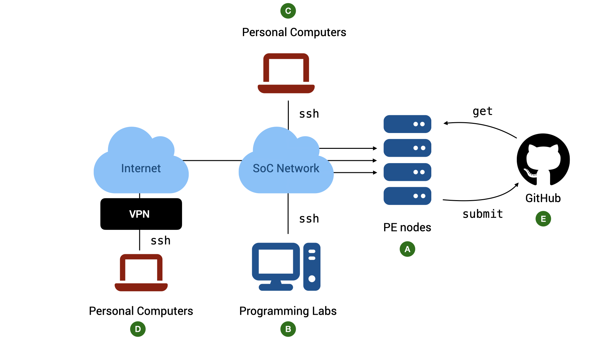

# The CS2030S Programming Environment


<div align="center" markdown>Figure 1: The CS2030S Programming Environment.  TL;DR: All work should be done on the PE nodes.  You can access the nodes via `ssh` through lab PCs or your personal devices.  If you need to access them outside SoC, you need to go through SoC VPN.</div>

## Java version

Java is a language that continues to evolve.  A new version is released every six months.  For CS2030S, we will _only_ use Java 25.  Specifically, we use `javac 25.0.3` on Ubuntu 24.04.4 LTS.

## PE Hosts

The school has provided a list of computing servers with the above environments for you to use (:material-alpha-a-circle: in Figure 1).  All the required software for CS2030S has been installed on the servers.  To access the server, we connect to a host called `pelogin`   (`pe` stands for "programming environment"), which will then redirect us to one of the servers.  We will refer to these servers generally as the _PE hosts._

We cannot choose which of the servers to use.  The host `pelogin` acts as a load balancer and will automatically assign you to the appropriate host.  You share the same home directory across all the hosts (this home directory, however, is different from that of `stu`).

## Accessing the PE Hosts

While you can complete the programming assignments on your own computers, the practical exams are done in a controlled environment using servers similar to the PE hosts.  It is therefore advisable for you to familiarize yourself with accessing the PE servers via `ssh` and edit your program with either Vim, micro or emacs (Vim is recommended and supported).

### Account

Basic requirements:

1. To access the hosts, you need an SoC Unix account.  If you do not have one, you can [apply for one online](https://mysoc.nus.edu.sg/~newacct/).

2. Once you have an account, you need to [activate your access to the computer clusters](https://mysoc.nus.edu.sg/~myacct/services.cgi), which are part of the SoC computer clusters.

3. To access PE Hosts from your computer (:material-alpha-c-circle: or :material-alpha-d-circle: in Figure 1) you need

    - a command line `ssh` client.  Windows 10/11, macOS, and Linux users should already have `ssh` installed by default.  If your OS does come with `ssh` (i.e., it cannot find the `ssh` command when you type `ssh` into your terminal), look for instructions on how to install OpenSSH client on your operating system.
   - a [terminal emulator](unix/background.md#what-is-a-terminal).  The default terminal emulator that comes with Windows and Mac supports only basic features.  For Windows 10/11 users, CS2030S recommends either PowerShell (pre-installed) or [Windows Terminal](https://apps.microsoft.com/detail/9n0dx20hk701?ocid=webpdpshare).  For macOS users, CS2030S recommends [iTerm2](https://iterm2.com/).

### The Command to SSH

You can access the PE hosts remotely via `ssh` (Secure SHell).

In general, to connect to a remote host, run the following in your terminal on your local computer:

```
ssh <username>@<hostname>
```

Replace `<username>` with your SoC Unix username and `<hostname>` with `pelogin`. For instance, I would do:
```
ssh ooiwt@pelogin.comp.nus.edu.sg
```

After the command above, follow the instructions on the screen.  The first time you ever connect to `pelogin.comp.nus.edu.sg`, you will be warned that you are connecting to a previously unknown host.  Answer `yes`.  After that, you will be prompted with your SoC Unix password.  Note that nothing is shown on the screen when your password is being entered.

<script src="https://asciinema.org/a/Q16Pasdpw98rHcD25OU8kLAMh.js" id="asciicast-Q16Pasdpw98rHcD25OU8kLAMh" async="true"></script>

### Accessing The PE Hosts from Outside SoC

The PE hosts can only be accessed from within the School of Computing networks.  If you want to access it from outside the network, you need to connect through NUS VPN (:material-alpha-d-circle: in Figure 1).  Note that even if you are physically within SoC, but you are connected to the Internet through mobile network tethering, the NUS_GUEST WiFi network, or any other external networks, you still need to connect through NUS VPN.  To connect to the School of Computing network within the premise of School of Computing, you need to connect to NUS_STU.

First, you need to set up a Virtual Private Network (VPN) (See [instructions here](https://nusit.nus.edu.sg/eguides/)).  We can no longer connect via SoC VPN.

!!! note "SoC VPN vs NUS VPN"

    Note that SoC VPN is different from NUS VPN.  SoC VPN is no longer supported.

!!! note "FortiClient VPN vs FortiClient"

    When you setup the SoC VPN client, please make sure that you download and install "FortiClient VPN Only", and not "FortiClient".  The latter is a commercial product that would stop working after the free trial is over.   On the other hand, "FortiClient VPN" is a free product.

### Accessing The PE Hosts from SoC Lab PCs

CS2030S practical exams will be conducted in the programming labs in COM1, COM4, AS6, and possibly MPH using the Ubuntu environment on the lab PCs.  Students are advised to use the lab PCs during regular lab sessions to familiarize themselves with the environment (:material-alpha-b-circle: in Figure 1).  

To access the PE hosts from the lab PCs during lab sessions:

- Boot into Ubuntu if the PC is not already running Ubuntu
- Log into the PC using the SoC Unix account
- Launch the terminal and use `ssh` command above.

!!! warning
    The local home directory on the lab PCs will be cleaned regularly.  _Do not expect that files stored in the lab PCs to be persistent_.  You can copy your files to external drive, to your home directory on the PE hosts, or to a cloud storage.

### Copying Files between PE Nodes and Local Computer

As the PE hosts are meant to simulate the practical exam environments, `scp` and `sftp` are blocked on `pelogin`.  We recommend working on `pelogin` directly as it will be a good practice to prepare for your practical.
    
### Troubleshooting SSH Connection

Some common error messages you may receive when you `ssh` and what they mean:

1. > `ssh: Could not resolve hostname pelogin.comp.nus.edu.sg`

    `ssh` cannot recognize the name `pelogin`. Likely, you tried to connect to the PE hosts directly from outside of the SoC network.

2. > `error : Unable to allocate resources : Invalid account or account/partition combination specified`

    You have connected to the PE host, but you are kicked out because you have no permission to use the host.

    Make sure you have activated your access to "SoC computer clusters" [here](https://mysoc.nus.edu.sg/~myacct/services.cgi).

3. > `Permission denied, please try again`

    You did not enter the correct password or username.  Please use the username and password of your SoC Unix account which you have created [here](https://mysoc.nus.edu.sg/~newacct/).

    Check that you have entered your username correctly.  It is _case-sensitive_.

    If you have lost your password, go here [to reset your password](https://mysoc.nus.edu.sg/~myacct/resetpass.cgi).

4. > `Could not chdir to home directory /home/o/ooiwt: Permission denied`

    This error means that you have successfully connected to the PE hosts, but you have no access to your home directory. 

    This should not happen.  Please [file a service request with SoC IT Unit](https://rt.comp.nus.edu.sg/). Include the error message, the PE hosts that you connected to, and your username.  The system administrator can reset the permission of your home directory for you.

## Setting up SSH Keys

The next step is not required but is a time-saver and a huge quality-of-life improvement.  _You need to be familiar with basic Unix commands_, including how to check/change file permissions (using `ls -l` and `chmod`), and how to open, edit, and save a file using Vim.  If you are still not comfortable with these commands, make sure you play with the [basic Unix commands](unix/essentials.md) and [Vim](vim/philosophy.md).  You can come back and complete this step later. 

Our goal here is to set up a pair of public/private keys for authentication so that you do not need to type your password every time you log into a PE host.

You can use the following command on your local computer to generate a pair of keys:
```
ssh-keygen -t rsa
```

This command will generate two keys, a private key `id_rsa`, and a public key `id_rsa.pub`.  You will be prompted for a passphrase.  This is the passphrase to protect your private key on your local computer.  You can enter an empty passphrase (at the cost of weaker security) to avoid being prompted for the passphrase whenever you access the private key[^1].
Keep the private key `id_rsa` on your local machine in the hidden `~/.ssh` directory and copy the public key `id_rsa.pub` to your account on PE `pelogin`.

The following are the steps to copy `id_rsa.pub` to the PE hosts.

- On a PE host, create a directory named `.ssh` in your home directory if it does not already exist.

- Edit the file named `authorized_keys` under the `.ssh` directory.

```Shell
vim ~/.ssh/authorized_keys
```

- Once in Vim, enter `INSERT` mode, and copy-and-paste the content of `id_rsa.pub` from the local machine into `authorized_keys` using your terminal copy-and-paste feature (the actual keys to copy and to paste depends on your OS and Terminal).  Make sure that the content is pasted as a single line without any extra spaces.  Save `authorized_keys` and exit Vim.


- Make sure that the permission for `.ssh` both on the local machine and on PE is set to `700` and the files `~/.ssh/id_rsa` on the local machine and `~/.ssh/authorized_keys` on the remote machine are set to `600`.  See the guide on using [`ls`](unix/essentials.md#ls-list-content-of-a-directory) and [`chmod`](unix/essentials.md#file-permission-management) if you are unsure how to do this.

Once set up, you need not enter your password every time you run `ssh pelogin` from your personal computer.

## Stability of Network Connection
    
Note that a stable network connection is required to use the PE hosts for a long period without interruption.   If you encounter frequent disconnections while working at home or on campus while connected wirelessly, please make sure that your Wi-Fi signal is strong and that there is no interference from other sources. 

If your connection is disconnected in the middle of editing, Vim saves the state of the buffer for you.  See the section on [swap files](vim/operations.md#swap-files) on how to recover your files.


[^1]: Alternatively you can read more about setting up `ssh-agent` with a passphrase for better security.
