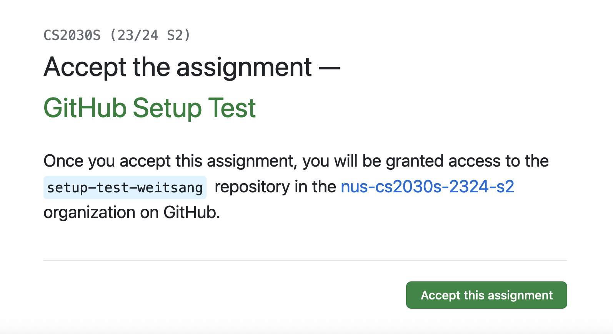

# Linking Your PE Account to Your GitHub Account

## Prerequisites

1. You should already have your SoC Unix account, cluster access, and SoC VPN set up, and be able to `ssh` into one of the PE hosts.  If you are not able to do this, please look at the guide on [programming environments](environments.md).
2. You should feel comfortable running basic UNIX commands.  If you have not gone through the UNIX guide and got your hands dirty, please [look at the guide and play with the various basic Unix commands](unix/essentials.md).
3. You should already have a GitHub account and can log into [GitHub.com](https://www.github.com).
4. {++You have set up vim according to [the set up instruction](vim/setup.md)++}

## Purpose

You will be using `git` (indirectly) for retrieving skeleton code and submitting completed assignments.  We will set up your accounts on a PE host below so that `git` will be associated with your GitHub account.  This is a one-time setup.  You don't have to do this for every programming exercise.

## 1. Setting up `.gitconfig`

Run the following commands to configure `git`:

```Bash
git config --global user.name <your name>
git config --global user.email <your email>
git config --global github.user <your github user name>
```

Your email should be whatever you used to sign up on GitHub (which may not be your SoC or NUS email).

For example, 

```
git config --global user.name "Ah Beng"
git config --global user.email "ahbeng@example.com"
git config --global github.user "ahbeng67"
```

After the above, you can check if the configuration is set correctly by running the following commands:

```
git config --get github.user
```

It should print your GitHub username as already set.  If there is a typo, you can rerun the corresponding command to edit the configuration.

You can also check the file `~/.gitconfig` by running:
```
cat ~/.gitconfig
```

It should show something like:
```
[user]
    name = Ah Beng
    email = ahbeng@example.com
[github]
    user = ahbeng67
```

## 2. Setting up Password-less Login

- Login to [GitHub.com](https://www.github.com) using your account.  Ensure that you are using the account you registered for CS2030S.

- Go to the URL [https://github.com/settings/tokens](https://github.com/settings/tokens). Alternatively, Click on Your Profile Avatar -> Settings -> Developer Settings -> Personal Access Tokens -> Tokens (classic)

   The page should say "Personal access tokens (classic)" at the top.


- Click on "**Generate new token**" (on the top-right), then **Generate new token (classic)**  You will be asked to enter the following information:

   - **Note**: Enter something meaningful to you to explain what this token is for
   - **Expiration**: Set a **Custom** duration that covers until the end of the semester (e.g., 15/05/2027)
   - **Select scopes**: Select "**repo**" (all the subscopes will be selected automatically)

After setting the above, click on the "**Generate token**" button at the bottom of the page.  

Your personal access token will be created.  Copy-paste this to somewhere safe and private. We will be using it in the next step.

Students who are actively using GitHub for other work and prefer to have finer control over the token permissions may choose to create fine-grain personal access token instead, and configure its permission to your personal preference.   

## 3. Accept and Retrieve a Test Skeleton from GitHub

### 3.1 Accept the Test Assignment

We have created an empty lab for you to test if you can correctly retrieve future lab files from GitHub.  Complete the following steps:

- Click here [https://classroom.github.com/a/mdTUrnes](https://classroom.github.com/a/mdTUrnes) to accept the assignment.  You should see the following page:

{: style="width:500px"}

- Click the accept button.  Wait a bit and then refresh until you see a "You're ready to go" message.

{++If you see an error message saying "Repository Access Issue", check your email for an invitation message from github-classroom.  Click the link in the email to accept the invitation.  After accepting the invitation, go back to the link above and refresh the page again.  You should see a "You're ready to go" message.++}

### 3.2 Configure the PE Host to Store Your Credentials

Now, on your PE host, run
```Bash
git config --global credential.helper store
```

This step ensures that your GitHub credentials (username and personal access token) will be stored securely on the PE host so that you don't have to enter them every time you interact with GitHub.

### 3.3 Retrieve the Test Skeleton

Now, run
```Shell
/opt/course/cs2030s/get setup-test
```

### 3.4 Authentication
You will then be asked for your username and password.

For the username, enter your **GitHub username**.  For the password, paste your **token** from Step 2 above.  Note that there will be nothing shown on the screen when you type your token.  Just paste it and press Enter.

### 3.5 Results
If everything works well, you should see:

```
Cloning into 'setup-test-<username>'...
Username for 'https://github.com': <username>
Password for 'https://<username>@github.com': <token>
remote: Enumerating objects: 9, done.
remote: Counting objects: 100% (9/9), done.
remote: Compressing objects: 100% (5/5), done.
remote: Total 9 (delta 1), reused 6 (delta 0), pack-reused 0 (from 0)
Receiving objects: 100% (9/9), done.
Resolving deltas: 100% (1/1), done.
```
Change your working directory into `setup-test-<username>` and look at the directory content.  It should contain a file `README.md`. 

If you have followed the steps above correctly, any subsequent cloning of github repository does not require username and password to be inserted anymore.  Only Steps 3.1 and 3.3 need to be repeated for each programming exercise (but with different links and different exercise ID).  

You can test by accepting ex0 and cloning it once it is ready.
