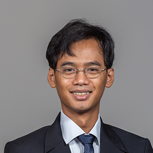
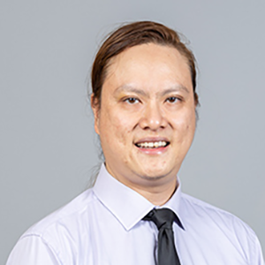
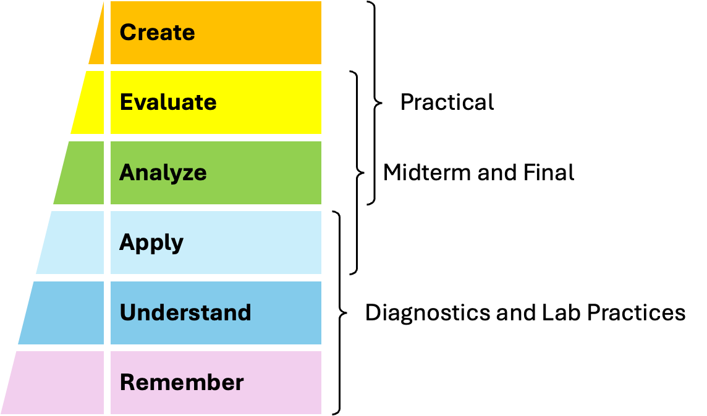

layout: true
class: wide, basic, layout, imaging, fonts, lists, cards, fadein, tabler
name: content

Programming Methodology :: Adi Yoga S. Prabawa

---
name: Admin
class: bottom, titles

# CS2030S
## Programming Methodology II
### Administration

---
name: Admin
class: sections

.topsub.subsections[
### Teams
]
.botbody.oldsections[
#### Academic
.col100[
.card.bg-b[
##### Staff
.content.tight.flexcard[
.col50[

]
.col50[

]
]
]
]
.col100[
.card.bg-b[
##### Instructors
.content.tight.nol.flexcard[
.col50[
**Recitation**

- Adi Yoga Sidi Prabawa
- Leong Wai Kay
- Ma Yuan
]
.col50[
**Lab**

- 16 Undergraduate TAs
]
]
]
]
]

---

.topsub.subsections[
### Teams
### Sessions
#### Lecture
]
.botbody.oldsections[
#### Lecture
.col100[
.card.bg-b[
##### Lecture Sessions
.content.tight[
(.X[Lecture] &rarr; .X.op20[Recitation] &rarr; .X.op20[Lab]) + .op20[_Help Session_]
]
.content.tight[
- Understanding of concepts.
- Recordings are on a .X[best-effort] basis.
- May use .X[whiteboard] .note18[(may not be captured in recording)].
- Slides are only for .X[guides] .note18[(may not be suitable for revision)].
- Slides are posted one day after the lecture.
]
]
]
.col100[
.card.bg-b[
##### Quote
.content.tight[
Education is not the filling of a bucket but the lighting of a fire.
]
]
]
]

---

.topsub.subsections[
### Teams
### Sessions
#### Lecture
#### Rec
]
.botbody.oldsections[
#### Recitation and Lab
.col100[
.card.bg-b[
##### Recitation and Lab Sessions
.content.tight[
(.X.op20[Lecture] &rarr; .X[Recitation] &rarr; .X[Lab]) + .op20[_Help Session_]
]
.content.tight[
- Application of concepts.
- Face-to-face with no recordings.
- Starts on .X[Week 03].
- Registration starts this week.
  - Registration and appeal on .hilite-y.X[CourseReg].
  - Do .R[NOT] email teaching team for appeal.
]
]
]
]

---

.topsub.subsections[
### Teams
### Sessions
#### Lecture
#### Rec
#### Help
]
.botbody.oldsections[
#### Help
.col100[
.card.bg-b[
##### Help Session
.content.tight[
(.X.op20[Lecture] &rarr; .X.op20[Recitation] &rarr; .X.op20[Lab]) + _Help Session_
]
.content.tight[
- .X[Vim/Unix Bootcamp]: TBA, expect on Week 2.cite[].
- .X[Clinics]: Approximately every 2-3 weeks.
  - No new materials.
  - Face-to-face onsite.
]
]
]
.col100[
.card.notes[
##### Note
.content.tight[
.X[Vim] is one of the code editors you are allowed to use during practical exams.
]
.content.tight[
.note18[You may also use Emacs, but we have no bootcamp for it.]
]
]
]
]
.footnote[NUS Hackers is also planning to host Vim workshop.]

---

.topsub.subsections[
### Teams
### Sessions
### Communication
#### Forum
]
.botbody.oldsections[
#### Forum
.col100[
.card.bg-b[
##### Ed Forum
.content.tight[
.X[Curriculum] related matters.
]
.content.tight[
- We expect discussions among students.
- Teaching team will chip in only if needed .note18[(e.g., questions are not answered after X number of days)].
]
]
]
]

---

.topsub.subsections[
### Teams
### Sessions
### Communication
#### Forum
#### UG
]
.botbody.oldsections[
#### Undergraduate Office
.col100[
.card.bg-b[
##### UG Office
.content.tight[
.X[Absence] related matters .note18[(e.g., absence from graded assessments)].
]
.content.tight[
- Apply for .X[short-term LOA] to UG office.
  - This includes medical absence.
- Approval is strictly done by UG office.
  - Ensure uniformity of decision.
  - Ensure no potentially sensitive information is leaked.
]
]
]
.col100[
.card.notes[
##### Note
.content.tight[
Do not send your medical ceritifcate to us, please apply for short-term LOA to UG office directly.
]
]
]
]

---

.topsub.subsections[
### Teams
### Sessions
### Communication
#### Forum
#### UG
#### Canvas
]
.botbody.oldsections[
#### Survey
.col100[
.card.bg-b[
##### Canvas Survey
.content.tight[
.X[Review] related matters .note18[(e.g., grading review)].
]
.content.tight[
- Canvas survey will be opened after each grading.
  - Use the correct canvas survey for review.
  - Review will only be done after survey deadline.
- Canvas survey will be opened for marks transfer .note18[(e.g., Softmark to Canvas)].
  - Check that your mark is correctly transfered.
  - Check that your review has been processed correctly.
  - No further marks review will be accepted.
- Proper justification will be required.
  - Marks may decrease after .note18[(mistakes may go both ways)].
]
]
]
]

---

.topsub.subsections[
### Teams
### Sessions
### Communication
#### Forum
#### UG
#### Canvas
#### Email
]
.botbody.oldsections[
#### Email
.col100[
.card.bg-b[
##### CS2030S Email
.content.tight[
Only for .X[sensitive] or .X[personal] matter.
]
.content.tight[
- Email to .X[`cs2030s@nus.edu.sg`].
- Prefix your email subject with .X[`[CS2030S]`] .note18[(including the square bracket)].
- Use your NUS email.
]
]
]
.col100[
.card.bg-r[
##### Strictly for Sensitive Matters
.content.tight[
- Do .R[NOT] email academic staff for other matters .note18[(e.g., clarification of materials)].
  - We are teaching multiple courses.
  - We receive tons of emails every day.
  - You may receive faster reply from discussions in Ed forum.
]
]
]
]

---

.topsub.subsections[
### Teams
### Sessions
### Communication
### Assessments
#### Classification
]
.botbody.oldsections[
#### Classification
.col100[
.card.bg-b[
##### By Assessment Type
.content.tight.flexcard[
.col50[
.atbl.ylhead.font16[
| Formative | % | Date/Time |
|---|---|---|
| Diagnostic | .X[5%] | Weekly |
| Sit-in Lab | .X[5%] | Every 1-2 Weeks |
| Exercise | .R[0%] | Every 1-2 Weeks |
| Problem Set | .R[0%] | Weekly |
]
.center.fsize16[.X[CS2030S is .R[NOT] ".U[bell-curved]"]]
]
.col50[
.atbl.ylhead.font16[
| Summative | % | Date/Time |
|---|---|---|
| Quiz | .X[10%] | Week 05/11 |
| Midterm | .X[20%] | Week 07 |
| PE 1 | .X[15%] | Week 07 |
| PE 2 | .X[15%] | Week 12 |
| Final | .X[30%] | .U[By OUR] |
]
]
]
]
]
.col100[
.card.bg-b[
##### By Bloom's Taxonomy
.content.tight[
.img75[]
]
]
]
]

---

.topsub.subsections[
### Teams
### Sessions
### Communication
### Assessments
#### Classification
#### Diagnostic
]
.botbody.oldsections[
#### Diagnostic
.col100[
.card.bg-b[
##### Diagnostic Quizzes
.content.tight[
- Weekly online take-home quizzes.
  - No time limit until deadline.
- Unlimited attempts.
  - We keep the highest score.
- 10 questions per quiz.
- 12 quizzes in total .note18[(drop your lowest 2 quizzes)]
- .R[NO] late submissions or makeup.
  - You are responsible for keeping track of deadline.
]
]
]
]

---

.topsub.subsections[
### Teams
### Sessions
### Communication
### Assessments
#### Classification
#### Diagnostic
#### Practical
]
.botbody.oldsections[
#### Practical
.col100[
.card.bg-b[
##### Sit-in Labs
.content.tight[
- Weekly/Bi-weekly sit-in lab practice.
  - Only active during your session and only in lab.
- Up to two attempts with discussion in between.
- 2 questions per practice with discussions after.
  - Pass test cases and other OOP checks to get the mark.
- 7 graded practicals in total .note18[(drop your lowest 2 practicals)]
- .R[NO] late submissions or makeup.
  - You are not allowed to come late for your session.
]
]
]
]

---

.topsub.subsections[
### Teams
### Sessions
### Communication
### Assessments
#### Classification
#### Diagnostic
#### Practical
#### Exercise
]
.botbody.oldsections[
#### Exercise
.col100[
.card.bg-b[
##### Programming Exercises
.content.tight[
- Weekly/Bi-weekly take-home programming exercise.
  - No time limit until deadline.
- Unlimited submission to GitHub within deadline.
- Medium size program with changing specification.
  - Submit on time to get comments on your attempts.
- 7-9 ungraded practice .note18[(but commented if submitted on time)].
- Late submissions will be ignored.
  - The concept may be asked/extended in PE.
]
]
]
.col100[
.card.notes[
##### Note
.content.tight[
You need to connect your GitHub account to Unix server. &nbsp; We will use GitHub to distribute your attempts .note18[(PE, Sit-in Labs, etc)].
]
]
]
]

---

.topsub.subsections[
### Teams
### Sessions
### Communication
### Assessments
### Policies
#### Plagiarism
]
.botbody.oldsections[
#### Plagiarism
.col100[
.card.bg-b[
##### Plagiarism Policies
.content.tight[
- All weighted formative and summative assessments must be individual work.
- We encourage discussion for formative assessments .note18[(except for lab practicals outside of official discussion)].
  - We prohibit sharing of code.
- Disciplinary actions will be taken against plagiarism.
]
]
]
]

---

.topsub.subsections[
### Teams
### Sessions
### Communication
### Assessments
### Policies
#### Plagiarism
#### AI
]
.botbody.oldsections[
#### AI
.col100[
.card.bg-b[
##### Use of AI
.content.tight[
- Be familiar with NUS policy on AI usage.
- You may use AI tools to assist your learning.
  - .X[OK].op0[.X[NT]].X[:] .op0[.] Ask AI tools for explanation.
  - .R[NOT].op0[.X[K]].X[:] .op0[.] Ask AI tools for solutions to assignments.
- You are responsible for validating AI output.
  - AI may use different conventions than our.
  - You are responsible for making sure your answer follows our convention.
- AI is .R[NOT] available during summative assessments.
  - Do not be dependent on AI.
]
]
]
]

---

.topsub.subsections[
### Teams
### Sessions
### Communication
### Assessments
### Policies
#### Plagiarism
#### AI
#### Well-Being
]
.botbody.oldsections[
#### Well-Being
.col100[
.card.bg-g[
##### Take Care
.content.tight[
- Mental wellness is important.
- If you can't cope or is falling behind, talk to us.
]
]
]
.col100[
.card.bg-g[
##### Health First
.content.tight[
- Health is important.
- If you are not feeling well, take medical leave.
  - We will try to accommodate with makeup.
  - However, makeup of makeup is not guaranteed.
- If you attend assessment, your short-term LOA may be deemed invalid.
  - UG office is pretty strict regarding "double-dipping".
]
]
]
]

---
name: Why?
class: sections

.topsub.subsections[
### Why CS2030S
#### Gap
]
.botbody.oldsections[
#### Gap
.col33[.op0[.]]
.col34[
.card.notes[
##### .center[CS1101S]
.content.tight[
.center[.note18[or equivalent]]
]
]
]
.col33[.op0[.]]
.vs10[]
.col33[.op0[.]]
.col34[
.card.notes.op0[
##### .
]
]
.col33[.op0[.]]
.vs10[]
.col33[.op0[.]]
.col34[
.card.bg-g[
##### .center[CS2030S]
]
]
.col33[.op0[.]]
.vs10[]
.col33[.op0[.]]
.col34[
.card.notes.op0[
##### .
]
]
.col33[.op0[.]]
.vs10[]
.col33[
.card.bg-b[
##### .center[Orbital]
]
]
.col34[
.card.bg-b[
##### .center[CS2103T]
]
]
.col33[
.card.bg-b[
##### .center[Internship]
]
]
.vs10[]
.col100[
##### C#, C++, Go, [Java](https://docs.oracle.com/en/java/javase/25/docs/api/index.html), Kotlin, Ruby, Rust, Python, Swift, Typescript, ...
]
]

---

.topsub.subsections[
### Why CS2030S
#### Gap
#### Curriculum
]
.botbody.oldsections[
#### Curriculum
.col33[.op0[.]]
.col34[
.card.notes[
##### .center[CS1101S]
.content.tight[
.center[.note18[or equivalent]]
]
]
]
.col33[.op0[.]]
.vs10[]
.col33[.op0[.]]
.col34[
.card.notes.op0[
##### .
]
]
.col33[.op0[.]]
.vs10[]
.col33[.op0[.]]
.col34[
.card.notes.op0[
##### .
]
]
.col33[.op0[.]]
.vs10[]
.col33[.op0[.]]
.col34[
.card.notes.op0[
##### .
]
]
.col33[.op0[.]]
.vs10[]
.col33[
.card.bg-g[
##### .center[CS2030S]
.content.tight[
PL & SE
]
]
]
.col34[
.card.bg-b[
##### .center[CS2040S]
.content.tight[
Theory & Algo
]
]
]
.col33[
.card.bg-b[
##### .center[CS2100]
.content.tight[
Comp System
]
]
]
]

---

.topsub.subsections[
### Why CS2030S
### Syllabus
#### Observation
]
.botbody.oldsections[
#### Observation
.col100[
.card.bg-b[
##### Real-World
.content.tight[
Real-world software is complex, evolves continuously, and is a product of team work.
]
]
]
]

---

.topsub.subsections[
### Why CS2030S
### Syllabus
#### Observation
#### What About
]
.botbody.oldsections[
#### What CS2030S is About
.col100[
.card.bg-g[
##### Better Code
.content.tight[
CS2030S teaches you how to write .X["better"] code.
]
.content.tight[
- More human-friendly.
- Easier to change and maintain.
- Fewer crashes and may recover from crashes.
]
.content.tight[
Achieved through programming paradigms, idioms, and language design.
]
]
]
]

---

.topsub.subsections[
### Why CS2030S
### Syllabus
#### Observation
#### What About
#### What Not About
]
.botbody.oldsections[
#### What CS2030S is Not About
.col100[
.card.bg-r[
##### Not Covered
.content.tight[
CS2030S is not a course about the following.
]
.content.tight[
- Algorithm or efficiency.
- Software design.
- Java language and libraries.
]
.content.tight[
These are covered in other courses. ​ The skill should be transferrable to other languages.
]
]
]
]

---
class: middle, end, fadein

.eol[`jshell> /exit`]

.eol[`| Goodbye`]