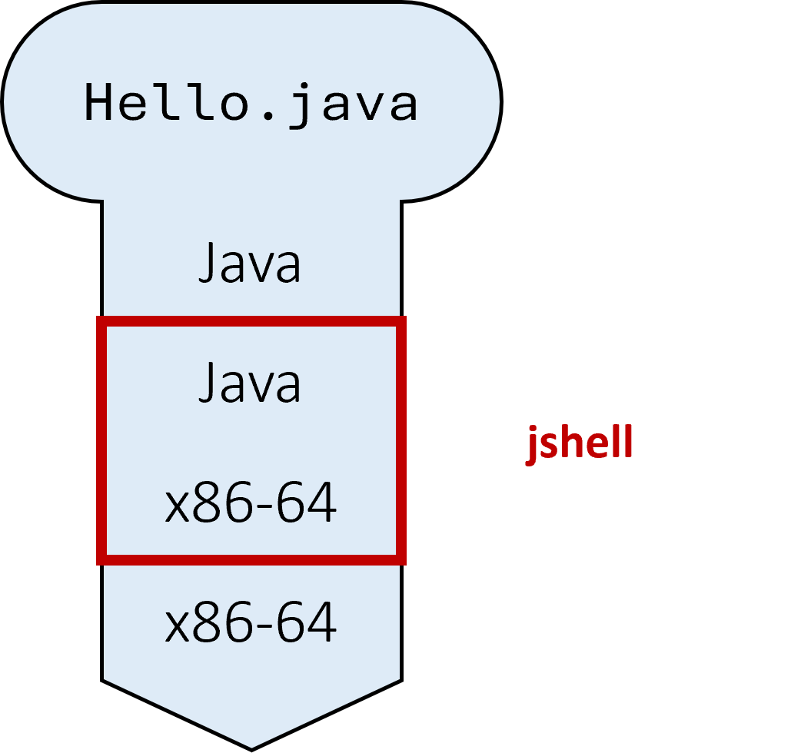
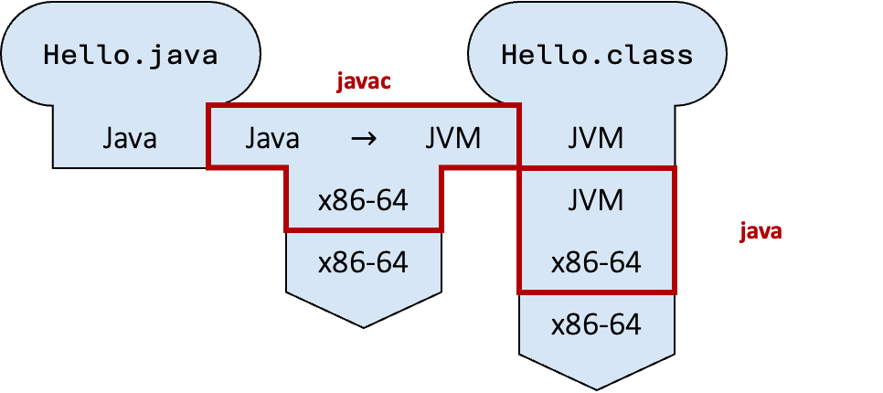
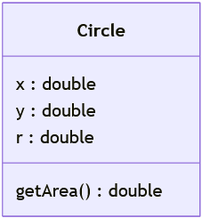
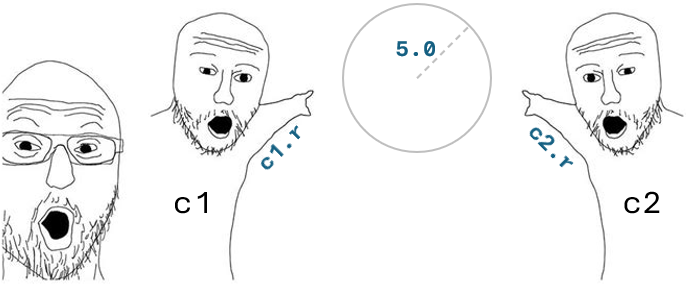

layout: true
class: wide, basic, layout, imaging, fonts, lists, cards, fadein, tabler
name: content
<div class="basic header"></div>
<div class="basic footer"><p>Programming Methodology :: Adi Yoga S. Prabawa</p></div>

---
name: Admin
class: bottom, titles

# CS2030S
## Programming Methodology II
### Java

---
name: Basic
class: sections

.topsub.subsections[
### Execution
#### Interpretation
]
.botbody.oldsections[
#### Interpretation
.col100[
.card.bg-b[
##### jshell
.content.tight[
.img46.center[]
]
]
]
]

---

.topsub.subsections[
### Execution
#### Interpretation
#### Compilation
]
.botbody.oldsections[
#### Compilation
.col100[
.card.bg-b[
##### javac + java
.content.tight[
.center.img97[]
]
]
]
]

---

.topsub.subsections[
### Execution
### Compiler
#### Principle
]
.botbody.oldsections[
#### Principle
.col100[
.card.bg-b[
##### Catch Errors Early
.content.tight[
.center[]
]
]
]
]

---

.topsub.subsections[
### Execution
### Compiler
#### Principle
#### Type
]
.botbody.oldsections[
#### Type
.col100[
.card.bg-b[
##### Type
.content.tight[
A .X[type] is an abstraction of values.
]
.content.tight[
- Determines the set of values that can be stored in variables.
- Determines the computations that can be done on the value.
]
]
]
]

---

.topsub.subsections[
### Execution
### Compiler
#### Principle
#### Type
#### System
]
.botbody.oldsections[
#### System
.col100[
.card.bg-b[
##### Type System
.content.tight[
A .X[type system] is a set of rules about types their interactions.
]
]
]
.col46[
.vs10[]
.card.bg-r.op0[
##### Python
.content.tight[
```py
x = 4
x = "5"
```
]
]
]
.col7[

]
.col46[
.vs10[]
.card.bg-g.op0[
##### Java
.content.tight[
```java[lerr=2]
int x = 4;
x = (int) "5";
```
]
]
]
.vs10[]
.col37[

]
.col26[.op0[.]]
.col35[

]
.vs10[]
.col46[
.card.bg-r.op0[
##### JavaScript
.content.tight[
```js
let x = 4;
x = "5" - 4;
```
]
]
]
.col7[

]
.col46[
.card.bg-r.op0[
##### C
.content.tight[
```c
int x = 4;
x = (int) "5"; // ???
```
]
]
]
]
.footnote[Other courses may classify the type systems differently.]

---

.topsub.subsections[
### Execution
### Compiler
### Type
#### Primitive
]
.botbody.oldsections[
#### Primitive
.col100[
.card.bg-b[
##### Java Primitive Types
.content.tight[
.atbl.ylhead.font18[
| Data | Type | Size | Default.cite[] |
|---|---|---|---|
| Whole numbers | `byte`<br>`short`<br>`int`<br>`long` | 8-bits<br>16-bits<br>32-bits<br>64-bits | &nbsp; |
| Floating-point | `float`<br>`double` | 32-bits<br>64-bits | &nbsp; |
| Characters | `char` | 16-bits | &nbsp; |
| Boolean | `boolean` | _JVM dependent_ | &nbsp; |
]
]
]
]
]
.footnote[Default values are only used for _fields_ or when using Jshell.]

---

.topsub.subsections[
### Execution
### Compiler
### Type
#### Primitive
#### Sharing
]
.botbody.oldsections[
#### Sharing
.col100[
.card.bg-y[
##### Claim
.content.tight[
Primitive types in Java do .R[NOT] share their values.
]
]
]
]
.footnote[At some point, it should be sufficient for us to show a claim without "proof". &nbsp; You are expected to be able to come up with the "proof" on your own.]

---

.topsub.subsections[
### Execution
### Compiler
### Type
#### Primitive
#### Sharing
#### Subtyping
]
.botbody.oldsections[
#### Subtyping
.col100[
.card.bg-b[
##### Subtype and Supertype
.content.tight[
A type $S$ is a .X[subtype] of another type $T$ .note18[(written $S$ <: $T$)]
]
.content.tight[
.op0[.....] if and only if
]
.content.tight[
a piece of code written for variable of type $T$ can also be safely used on variables of type $S$.
]
.content.tight[
If $S$ <: $T$, then $T$ is a .X[supertype] of $S$.
]
]
]
]

---

.topsub.subsections[
### Execution
### Compiler
### Type
#### Primitive
#### Sharing
#### Subtyping
#### Primitive Subtype
]
.botbody.oldsections[
#### Primitive Subtyping
.col100[
.card.bg-y[
##### Claim
.content.tight[
`long` <: `float`.
]
]
]
.vs50[]
.vs50[]
.vs50[]
.col100[
.card.bg-y[
##### Question
.content.tight[
Can you find other primitive subtyping relationship?
]
]
]
]

---

.topsub.subsections[
### Execution
### Compiler
### Type
#### Primitive
#### Sharing
#### Subtyping
#### Primitive Subtype
#### Relationship
]
.botbody.oldsections[
#### Relationship
.col100[
.card.bg-b[
##### Subtyping Relationship
.content.tight.flexcard[
.col20[
- .X[Reflexive]
- .X[Transitive]
]
.col80.nol[
- $T$ <: $T$.
- if $S$ <: $T$ and $T$ <: $U$, then $S$ <: $U$.
]
]
]
]
]

---
name: Break
class: middle, break

# Break
<br>
## <i class="fa-regular fa-clock break-icon"></i>

---
name: Abstraction
class: sections

.topsub.subsections[
### Function
#### Motivation
]
.botbody.oldsections[
#### Motivation
.col100[
.card.bg-b[
##### Binomial Coefficient
.content.tight[
$$^nC_k=\frac{n!}{k! \ \ \ (n-k)!}$$
]
]
]
]

---

.topsub.subsections[
### Function
#### Motivation
]
.botbody.oldsections[
#### Motivation
.col100[
.card.bg-b[
##### Binomial Coefficient
.content.tight[
$$^nC_k=\frac{n!}{k! \ \ \ (n-k)!}$$
]
]
]
.col33[
```java
i = n;
res = 1;
while (i >= 0) {
  res = res * i;
  i = i - 1;
}
factn = res;
```
]
.col34[
```java
i = k;
res = 1;
while (i >= 0) {
  res = res * i;
  i = i - 1;
}
factk = res;
```
]
.col33[
```java
i = n - k;
res = 1;
while (i >= 0) {
  res = res * i;
  i = i - 1;
}
factnk = res;
```
]
]

---

.topsub.subsections[
### Function
#### Motivation
]
.botbody.oldsections[
#### Motivation
.col100[
.card.bg-b[
##### Binomial Coefficient
.content.tight[
$$^nC_k=\frac{n!}{k! \ \ \ (n-k)!}$$
]
]
]
.col33[
```java
i = n;
res = 1;
while (i >= 0) {
  res = res * i;
  i = i - 1;
}
factn = res;
```
]
.col34[
```java
i = k;
res = 1;
while (i >= 0) {
  res = res * i;
  i = i - 1;
}
factk = res;
```
]
.col33[
```java
i = n - k;
res = 1;
while (i >= 0) {
  res = res * i;
  i = i - 1;
}
factnk = res;
```
]
.col100[
```java
nck = factn / (factk * factnk);
```
]
]

---

.topsub.subsections[
### Function
#### Motivation
]
.botbody.oldsections[
#### Motivation
.col100[
.card.bg-b[
##### Binomial Coefficient
.content.tight[
$$^nC_k=\frac{n!}{k! \ \ \ (n-k)!}$$
]
]
]
.col33[
```java
i = n;
res = 1;
while (i >= 0) {
  res = res * i;
  i = i - 1;
}
factn = res;
```
]
.col34[
```java
i = k;
res = 1;
while (i >= 0) {
  res = res * i;
  i = i - 1;
}
factk = res;
```
]
.col33[
```java
i = n - k;
res = 1;
while (i >= 0) {
  res = res * i;
  i = i - 1;
}
factnk = res;
```
]
.col100[
```java
nck = factn / (factk * factnk);
```
]
.col100[
.card.bg-r[
##### Quick Quiz
.content.tight[
There is a mistake in the code above. &nbsp; Can you find the mistake and correct them? &nbsp; How many changes do you need to make?
]
]
]
]

---

.topsub.subsections[
### Function
#### Motivation
#### Generalization
]
.botbody.oldsections[
#### Generalization
.col100[
.card.bg-b[
##### Binomial Coefficient
.content.tight[
$$^nC_k=\frac{n!}{k! \ \ \ (n-k)!}$$
]
]
]
.col33[
```java[emph=2-6]
i = n;
res = 1;
while (i >= 0) {
  res = res * i;
  i = i - 1;
}
factn = res;
```
]
.col34[
```java[emph=2-6]
i = k;
res = 1;
while (i >= 0) {
  res = res * i;
  i = i - 1;
}
factk = res;
```
]
.col33[
```java[emph=2-6]
i = n - k;
res = 1;
while (i >= 0) {
  res = res * i;
  i = i - 1;
}
factnk = res;
```
]
]

---

.topsub.subsections[
### Function
#### Motivation
#### Generalization
]
.botbody.oldsections[
#### Generalization
.col100[
.card.bg-b[
##### Binomial Coefficient
.content.tight[
$$^nC_k=\frac{n!}{k! \ \ \ (n-k)!}$$
]
]
]
.col33[
```java[emph=2-6]
i = n;
res = 1;
while (i >= 0) {
  res = res * i;
  i = i - 1;
}
factn = res;
```
]
.col34[
```java[emph=2-6]
i = k;
res = 1;
while (i >= 0) {
  res = res * i;
  i = i - 1;
}
factk = res;
```
]
.col33[
```java[emph=2-6]
i = n - k;
res = 1;
while (i >= 0) {
  res = res * i;
  i = i - 1;
}
factnk = res;
```
]
.col33[.op0[.]]
.col34.font16[
```java[emph=2-6]
int fact(int i) {
  int res = 1;
  while (i >= 0) {
    res = res * i;
    i = i - 1;
  }
  return res;
}
```
]
.col33[.op0[.]]
]

---

.topsub.subsections[
### Function
### Encapsulation
#### Motivation
]
.botbody.oldsections[
#### Motivation
.col100[
.card.bg-y[
##### Question
.content.tight[
What is a circle?
]
.content.tight.nol[
- What are the properties relevant for a circle?
- What can you do with a circle?
]
]
]
]

---

.topsub.subsections[
### Function
### Encapsulation
#### Motivation
]
.botbody.oldsections[
#### Motivation
.col100[
.card.bg-y[
##### Question
.content.tight[
What is a circle?
]
.content.tight.nol[
- What are the properties relevant for a circle?
- What can you do with a circle?
]
]
]
.col100[
.img60.center[]
]
]

---

.topsub.subsections[
### Function
### Encapsulation
#### Motivation
]
.botbody.oldsections[
#### Motivation
.col100[
.card.bg-y[
##### Question
.content.tight[
What is a circle?
]
.content.tight.nol[
- What are the properties relevant for a circle?
- What can you do with a circle?
]
]
]
.col100[
.img60.center[]
]
]

---

.topsub.subsections[
### Function
### Encapsulation
#### Motivation
#### ADT
]
.botbody.oldsections[
#### Abstract Data Type
.col100[
.card.bg-y[
##### Question
.content.tight[
What is a circle?
]
.content.tight.nol[
- What are the properties relevant for a circle?
- What can you do with a circle?
]
]
]
]

---

.topsub.subsections[
### Function
### Encapsulation
#### Motivation
#### ADT
#### Syntax
]
.botbody.oldsections[
#### Syntax
.col100[
.card.bg-b[
##### Circle Class
.content.tight.flexcard[
.col70[
```java[lite=1]
class Circle {
  double x;
  double y;
  double r;

  double getArea() {
    return 3.14 * r * r;
  }
}
```
]
.col30[

]
]
]
]
]

---

.topsub.subsections[
### Function
### Encapsulation
#### Motivation
#### ADT
#### Syntax
#### Definition
]
.botbody.oldsections[
#### Definition
.col100[
.card.bg-b[
##### Encapsulation
.content.tight[
An .X[encapsulation] is a bundling related variables .note18[(i.e., fields)] and functions .note18[(i.e., methods)] together to create a class.
]
]
]
.col100[
.card.bg-b[
##### Instantiation, Access, and Invocation
.content.tight[
```java
Circle c = new Circle();
c.r = 5.0;
double circle_area = c.getArea();
```
]
]
]
]

---

.topsub.subsections[
### Function
### Encapsulation
#### Motivation
#### ADT
#### Syntax
#### Definition
#### Reference
]
.botbody.oldsections[
#### Reference
.col100[
.card.bg-b[
##### Reference Type
.content.tight[
Every type that is not a primitive type is a .X[reference type].
]
.content.tight[
A reference type stores only the .X[reference] to the value and not the value itself.
]
]
]
]

---

.topsub.subsections[
### Function
### Encapsulation
#### Motivation
#### ADT
#### Syntax
#### Definition
#### Reference
#### Issue
]
.botbody.oldsections[
#### Issue
.col100[
.card.bg-r[
##### Aliasing
.content.tight[
If two variables have the same reference, then there is an aliasing.
]
.content.tight[
```java[lite=3,5]
Circle c1 = new Circle();
Circle c2 = c1;
System.out.println(c2.r);
c1.r = 5.0;
System.out.println(c2.r);
```
]
]
]
]

---

.topsub.subsections[
### Function
### Encapsulation
#### Motivation
#### ADT
#### Syntax
#### Definition
#### Reference
#### Issue
]
.botbody.oldsections[
#### Issue
.col100[
.card.bg-r[
##### Aliasing
.content.tight[
If two variables have the same reference, then there is an aliasing.
]
.content.tight[
```java[lite=3,5]
Circle c1 = new Circle();
Circle c2 = c1;
System.out.println(c2.r); // 0.0
c1.r = 5.0;
System.out.println(c2.r); // 5.0
```
]
]
]
.vs50[]
.col100[

]
]

---

.topsub.subsections[
### Function
### Encapsulation
### OOP
]
.botbody.oldsections[
#### OOP Paradigm
.col100[
.card.bg-b[
##### Object-Oriented Programming
.content.tight[
In object-oriented programming, we solve problems by
]
.content.tight[
- organizing codes into classes,
- instantiating objects of different classes, and
- having the objects interacting with each other via method invocation.
]
]
]
]

---
name: Reminders
class: sections

.topsub.subsections[
### Reminders
]
.botbody.oldsections[
#### Todo
.col100[
.card.notes[
##### Readings
.content.tight.todo[
- Course policy on Canvas.
- Units 0 to 4 of online notes.
]
]

.card.notes[
##### Homeworks
.content.tight.todo[
- Self-diagnostic quiz 1 .note18[(due Friday)].
- Information quiz on course policy .note18[(due Friday)].
]
]

.card.notes[
##### Administrations
.content.tight.todo[
- Join the Ed forum .note18[(ask your questions here)].
- Setup Github and submit your username on Canvas.
]
]

.card.notes[
##### Preparations
.content.tight.todo[
- Read CS2030S programming environment, Unix, and Vim.
- Signup for Vim and Unix bootcamp .note18[(optional)].
- Read units 5 to 12 of online notes .note18[(for next week)].
]
]
]
]

---
class: middle, end, fadein

.eol[`jshell> /exit`]

.eol[`| Goodbye`]